<!-- THE WEB BELONGS TO CODEXANJAN -->
<!-- Great developers inspect the source. -->
<!--
       /\   /\
      //\\_//\\
      \_     _/
       / * * \
       \_/O\_/
    NODE: EARTH-CODEX-01 // ANJAN SHETTY // @codexanjan
    PROTOCOL: SPIDER-VERSE DEVELOPER COMMAND CENTER
-->

<!-- ========================================================================= -->
<!-- 01 // HERO WIDESCREEN CINEMATIC HEADER                                    -->
<!-- ========================================================================= -->

<picture>
  <source media="(prefers-color-scheme: dark)" srcset="assets/anjan-hero.svg" />
  <source media="(prefers-color-scheme: light)" srcset="assets/anjan-hero.svg" />
  
</picture>

  

<!-- DYNAMIC SPIDER-MAN MOTION TYPING TITLE -->

 

<!-- ========================================================================= -->
<!-- 02 // ABOUT ME // OPERATIVE DOSSIER                                       -->
<!-- ========================================================================= -->

##  ABOUT ME // OPERATIVE DOSSIER

> "Somewhere between an idea and a working product, there is a lot of debugging."

<table width="100%">
  <tr>
    <td width="42%" align="center" valign="middle">
      <a href="https://github.com/codexanjan">
        
      </a>
    </td>
    <td width="58%" valign="top">

<table>
  <tr>
    <td>

### <code>OPERATIVE IDENTIFICATION // EARTH-CODEX-01</code>

  <b>Operative:</b> Anjan Shetty 
  <b>Codename:</b> <code>@codexanjan</code> 
  <b>Security Clearance:</b> <code>Level 10 // Spider-Sense Alpha</code> 
  <b>Dimension:</b> <code>Earth-Codex-01</code> 
  <b>Division:</b> <code>Core Systems &amp; Web Architecture</code>

#### <code>// MULTIVERSE ROLES</code>
<ul>
  <li><b>Engineering Student</b> &bull; Computer Science &amp; Engineering</li>
  <li><b>Full Stack Developer</b> &bull; High-Performance Web Architectures</li>
  <li><b>AI/ML Solutions Architect</b> &bull; Autonomous Agentic Pipelines</li>
</ul>

#### <code>// CURRENTLY WEAVING</code>
<ul>
  <li><b>Full Stack:</b> MERN Stack &bull; Next.js &bull; TypeScript &bull; REST APIs</li>
  <li><b>AI Systems:</b> Agentic AI &bull; LLM Workflows &bull; Tool Calling</li>
  <li><b>Engineering:</b> Cloud Infrastructure &bull; WebGL 3D &bull; DevOps</li>
</ul>

#### <code>// MISSION PHILOSOPHY</code>
<blockquote>"With great compute comes great responsibility."</blockquote>

  
  &nbsp;&nbsp;&nbsp;&nbsp;
  

    </td>
  </tr>
</table>

</td>
  </tr>
</table>

 

<!-- ========================================================================= -->
<!-- 03 // SPIDER ARSENAL // TECH SUIT & CAPABILITIES                          -->
<!-- ========================================================================= -->

##  SPIDER ARSENAL // TECH SUIT &amp; CAPABILITIES

<a href="https://github.com/codexanjan">
  
</a>

  

<!-- WIRE SVG DIVIDER BELOW IMAGE -->

  

<i>A curated inventory of the languages, frameworks, and tools deployed across missions:</i>

<h4> // LANGUAGES</h4>

  
  &nbsp;
  
  &nbsp;
  
  &nbsp;
  
  &nbsp;
  
  &nbsp;
  
  &nbsp;
  

<h4> // FRAMEWORKS &amp; LIBRARIES</h4>

  
  &nbsp;
  
  &nbsp;
  
  &nbsp;
  
  &nbsp;
  
  &nbsp;
  

<h4> // BACKEND &amp; APIS</h4>

  
  &nbsp;
  
  &nbsp;
  
  &nbsp;
  

<h4> // DATABASES, CLOUD &amp; DEVOPS</h4>

  
  &nbsp;
  
  &nbsp;
  
  &nbsp;
  
  &nbsp;
  
  &nbsp;
  

<h4> // TOOLS &amp; OPERATIONS</h4>

  
  &nbsp;
  
  &nbsp;
  
  &nbsp;
  

 

 

<!-- ========================================================================= -->
<!-- 04 // TACTICAL PROFILE // DEVELOPER LEVEL                                 -->
<!-- ========================================================================= -->

##  TACTICAL PROFILE // DEVELOPER LEVEL


 

<!-- ========================================================================= -->
<!-- 05 // SPIDER TROPHY ROOM // MULTIVERSE ACCOLADES                          -->
<!-- ========================================================================= -->

##  SPIDER TROPHY ROOM // MULTIVERSE ACCOLADES


 

<!-- ========================================================================= -->
<!-- 06 // PROJECT DATABASE // SPIDER-VERSE ARCHIVES                           -->
<!-- ========================================================================= -->

##  PROJECT DATABASE // SPIDER-VERSE ARCHIVES

  

 

<table width="100%">
  <tr>
    <td width="50%" valign="top">
      <h4> <a href="https://github.com/codexanjan/urlforge">URLForge</a> // Link Forge &amp; Analytics Engine</h4>
      
High-performance URL shortener and link redirection architecture engineered for rapid dispatch, telemetry analytics, and clean RESTful design.

      <ul>
        <li><b>Focus:</b> Fast URL resolution, link analytics &amp; clean API architecture</li>
        <li><b>Stack:</b> <code>TypeScript</code> • <code>Node.js</code> • <code>Express</code> • <code>RESTful API</code></li>
        <li><b>Repository:</b> <a href="https://github.com/codexanjan/urlforge">codexanjan/urlforge</a></li>
      </ul>
    </td>
    <td width="50%" valign="top">
      <h4> <a href="https://github.com/codexanjan/periodictable">PeriodicPortal</a> // 3D Interactive Chemistry Hub</h4>
      
A modern educational web platform exploring all 118 chemical elements with glowing cards, 3D Bohr orbital models, trend analytics, and a built-in Chemistry AI chatbot.

      <ul>
        <li><b>Focus:</b> 3D orbital visualization, chemical data &amp; conversational AI</li>
        <li><b>Stack:</b> <code>TypeScript</code> • <code>React</code> • <code>Three.js</code> • <code>AI Integration</code></li>
        <li><b>Repository:</b> <a href="https://github.com/codexanjan/periodictable">codexanjan/periodictable</a></li>
      </ul>
    </td>
  </tr>
  <tr>
    <td width="50%" valign="top">
      <h4> <a href="https://github.com/codexanjan">Markdown Studio</a> // Live Browser Editor</h4>
      
Sleek browser-based Markdown studio offering real-time live preview, intelligent syntax highlighting, multi-format export tools, and productivity templates.

      <ul>
        <li><b>Focus:</b> Real-time parser rendering, AST manipulation &amp; responsive UX</li>
        <li><b>Stack:</b> <code>TypeScript</code> • <code>React</code> • <code>Markdown Engine</code></li>
        <li><b>Repository:</b> <a href="https://github.com/codexanjan">codexanjan/markdown-studio</a></li>
      </ul>
    </td>
    <td width="50%" valign="top">
      <h4> <a href="https://github.com/codexanjan">Smart Calendar</a> // Productivity &amp; Schedule Hub</h4>
      
Customizable personal scheduling platform built for calendar optimization, event management, and fluid user experience.

      <ul>
        <li><b>Focus:</b> State orchestration, responsive calendar view &amp; UX architecture</li>
        <li><b>Stack:</b> <code>TypeScript</code> • <code>React</code> • <code>Tailwind CSS</code> • <code>Vite</code></li>
        <li><b>Repository:</b> <a href="https://github.com/codexanjan">codexanjan/smart-calendar</a></li>
      </ul>
    </td>
  </tr>
  <tr>
    <td width="50%" valign="top">
      <h4> <a href="https://github.com/codexanjan/atmosphere">WeatherGPT</a> // AI Risk Intelligence</h4>
      
Synthesizes meteorological sensor feeds with predictive machine learning to forecast hazardous weather phenomena and automate emergency advisories.

      <ul>
        <li><b>Focus:</b> Atmospheric ML prediction, emergency alerts &amp; simulations</li>
        <li><b>Stack:</b> <code>Python</code> • <code>React</code> • <code>FastAPI</code> • <code>ML</code></li>
        <li><b>Repository:</b> <a href="https://github.com/codexanjan/atmosphere">codexanjan/atmosphere</a></li>
      </ul>
    </td>
    <td width="50%" valign="top">
      <h4> <a href="https://github.com/codexanjan/AJ-RUNNER">AJ Runner</a> // Endless WebGL Canvas Engine</h4>
      
A high-velocity arcade runner built on HTML5 Canvas and WebGL, featuring responsive physics simulations, procedural obstacle generation, and dynamic mechanics.

      <ul>
        <li><b>Focus:</b> Procedural rendering, game loop physics &amp; responsive controls</li>
        <li><b>Stack:</b> <code>JavaScript</code> • <code>HTML5 Canvas</code> • <code>WebGL</code> • <code>CSS3</code></li>
        <li><b>Repository:</b> <a href="https://github.com/codexanjan/AJ-RUNNER">codexanjan/AJ-RUNNER</a></li>
      </ul>
    </td>
  </tr>
</table>

 

<!-- ========================================================================= -->
<!-- 07 // SPIDER-VERSE CREDENTIAL VAULT // HACKERRANK VERIFIED                -->
<!-- ========================================================================= -->

##  SPIDER-VERSE CREDENTIAL VAULT // HACKERRANK VERIFIED

  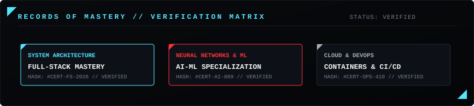

 

<table width="100%">
  <tr>
    <td width="50%" valign="top">
      <h4> Software Engineer</h4>
      
<b>Issuer:</b> HackerRank • <b>Type:</b> Role Certification

      
<b>Credential ID:</b> <code>31cd0e8e1f1e</code>

      
<b>Verified Skills:</b> Problem Solving, REST API, SQL Architecture

      
<a href="https://www.hackerrank.com/certificates/31cd0e8e1f1e"><b>[ VERIFY CREDENTIAL RECORD ]</b></a>

    </td>
    <td width="50%" valign="top">
      <h4> Software Engineer Intern</h4>
      
<b>Issuer:</b> HackerRank • <b>Type:</b> Role Certification

      
<b>Credential ID:</b> <code>b11da9da4539</code>

      
<b>Verified Skills:</b> Core Software Engineering &amp; Problem Solving

      
<a href="https://www.hackerrank.com/certificates/b11da9da4539"><b>[ VERIFY CREDENTIAL RECORD ]</b></a>

    </td>
  </tr>
  <tr>
    <td width="50%" valign="top">
      <h4> Problem Solving (Intermediate)</h4>
      
<b>Issuer:</b> HackerRank • <b>Type:</b> Skill Verification

      
<b>Credential ID:</b> <code>895206b6961b</code>

      
<b>Verified Skills:</b> Complex Data Structures &amp; Graph Algorithms

      
<a href="https://www.hackerrank.com/certificates/895206b6961b"><b>[ VERIFY CREDENTIAL RECORD ]</b></a>

    </td>
    <td width="50%" valign="top">
      <h4> REST API (Intermediate)</h4>
      
<b>Issuer:</b> HackerRank • <b>Type:</b> Skill Verification

      
<b>Credential ID:</b> <code>9ae0bb1b82ab</code>

      
<b>Verified Skills:</b> HTTP Protocols, API Orchestration &amp; Rate Limiting

      
<a href="https://www.hackerrank.com/certificates/9ae0bb1b82ab"><b>[ VERIFY CREDENTIAL RECORD ]</b></a>

    </td>
  </tr>
  <tr>
    <td width="50%" valign="top">
      <h4> JavaScript (Intermediate)</h4>
      
<b>Issuer:</b> HackerRank • <b>Type:</b> Skill Verification

      
<b>Credential ID:</b> <code>b61de8917e66</code>

      
<b>Verified Skills:</b> Event Loop, Concurrency, Design Patterns &amp; Memory

      
<a href="https://www.hackerrank.com/certificates/b61de8917e66"><b>[ VERIFY CREDENTIAL RECORD ]</b></a>

    </td>
    <td width="50%" valign="top">
      <h4> React (Basic)</h4>
      
<b>Issuer:</b> HackerRank • <b>Type:</b> Skill Verification

      
<b>Credential ID:</b> <code>1b67ca39f417</code>

      
<b>Verified Skills:</b> JSX, State Orchestration &amp; Component Lifecycle

      
<a href="https://www.hackerrank.com/certificates/1b67ca39f417"><b>[ VERIFY CREDENTIAL RECORD ]</b></a>

    </td>
  </tr>
  <tr>
    <td width="50%" valign="top">
      <h4> Node.js (Basic)</h4>
      
<b>Issuer:</b> HackerRank • <b>Type:</b> Skill Verification

      
<b>Credential ID:</b> <code>1c041db19a8b</code>

      
<b>Verified Skills:</b> Asynchronous I/O, Event Emitters &amp; Stream Buffers

      
<a href="https://www.hackerrank.com/certificates/1c041db19a8b"><b>[ VERIFY CREDENTIAL RECORD ]</b></a>

    </td>
    <td width="50%" valign="top">
      <h4> SQL (Basic)</h4>
      
<b>Issuer:</b> HackerRank • <b>Type:</b> Skill Verification

      
<b>Credential ID:</b> <code>43477c74733f</code>

      
<b>Verified Skills:</b> Relational Joins, Aggregations &amp; Query Optimization

      
<a href="https://www.hackerrank.com/certificates/43477c74733f"><b>[ VERIFY CREDENTIAL RECORD ]</b></a>

    </td>
  </tr>
  <tr>
    <td width="50%" valign="top">
      <h4> Java (Basic)</h4>
      
<b>Issuer:</b> HackerRank • <b>Type:</b> Skill Verification

      
<b>Credential ID:</b> <code>8a4745b17ffa</code>

      
<b>Verified Skills:</b> OOP Paradigms, Inheritance &amp; Java Collections

      
<a href="https://www.hackerrank.com/certificates/8a4745b17ffa"><b>[ VERIFY CREDENTIAL RECORD ]</b></a>

    </td>
    <td width="50%" valign="top">
      <h4> Go (Basic)</h4>
      
<b>Issuer:</b> HackerRank • <b>Type:</b> Skill Verification

      
<b>Credential ID:</b> <code>d6f0d86e4e95</code>

      
<b>Verified Skills:</b> Goroutines, Channel Synchronization &amp; Interfaces

      
<a href="https://www.hackerrank.com/certificates/d6f0d86e4e95"><b>[ VERIFY CREDENTIAL RECORD ]</b></a>

    </td>
  </tr>
  <tr>
    <td width="50%" valign="top">
      <h4> CSS (Basic)</h4>
      
<b>Issuer:</b> HackerRank • <b>Type:</b> Skill Verification

      
<b>Credential ID:</b> <code>71a4e0d7b9b5</code>

      
<b>Verified Skills:</b> Modern Layouts, Flexbox, Grid &amp; Responsive CSS

      
<a href="https://www.hackerrank.com/certificates/71a4e0d7b9b5"><b>[ VERIFY CREDENTIAL RECORD ]</b></a>

    </td>
    <td width="50%" valign="top">
      <h4> C# (Basic)</h4>
      
<b>Issuer:</b> HackerRank • <b>Type:</b> Skill Verification

      
<b>Credential ID:</b> <code>c795280a3cee</code>

      
<b>Verified Skills:</b> .NET Architecture, LINQ Queries &amp; Type Systems

      
<a href="https://www.hackerrank.com/certificates/c795280a3cee"><b>[ VERIFY CREDENTIAL RECORD ]</b></a>

    </td>
  </tr>
</table>

 

<!-- ========================================================================= -->
<!-- 08 // SPIDER TELEMETRY // MAINFRAME METRICS                               -->
<!-- ========================================================================= -->

##  SPIDER TELEMETRY // MAINFRAME METRICS


 

<!-- ========================================================================= -->
<!-- 09 // COMMIT RADAR // CODE CADENCE                                        -->
<!-- ========================================================================= -->

##  COMMIT RADAR // CODE CADENCE


 

<!-- ========================================================================= -->
<!-- 10 // CONTRIBUTION PATROL // SPIDER CADENCE                               -->
<!-- ========================================================================= -->

##  CONTRIBUTION PATROL // SPIDER CADENCE


  

<!-- CONTRIBUTION GRID SNAKE -->
<picture>
  <source media="(prefers-color-scheme: dark)" srcset="https://raw.githubusercontent.com/codexanjan/codexanjan/output/github-contribution-grid-snake-dark.svg" />
  <source media="(prefers-color-scheme: light)" srcset="https://raw.githubusercontent.com/codexanjan/codexanjan/output/github-contribution-grid-snake.svg" />
  
</picture>

 

<!-- ========================================================================= -->
<!-- 11 // CONNECT // SEND A SIGNAL ACROSS THE WEB                             -->
<!-- ========================================================================= -->

##  CONNECT // SEND A SIGNAL ACROSS THE WEB

<i>Connect across developer networks, coding platforms, and intelligence channels:</i>

  
  &nbsp;
  
  &nbsp;
  
  &nbsp;
  

  
  &nbsp;
  
  &nbsp;
  
  &nbsp;
  

  
  &nbsp;
  
  &nbsp;
  
  &nbsp;
  

  
  &nbsp;
  
  &nbsp;
  

 

  

<!-- DYNAMIC SPIDER-MAN ENDING MOTION TEXT -->

 

<!-- ========================================================================= -->
<!-- 12 // FOOTER                                                              -->
<!-- ========================================================================= -->

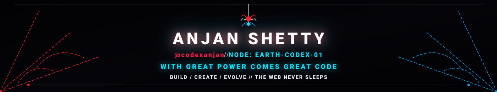

