<!-- ========================================================================= -->
<!-- 🕷️ SPIDER-VERSE DEVELOPER COMMAND CENTER                                -->
<!-- DEVELOPER PROFILE README: ANJAN SHETTY (@codexanjan)                     -->
<!-- THEME: SPIDER-VERSE × CYBERPUNK HUD × DEVELOPER TERMINAL                -->
<!-- ========================================================================= -->

<!--
╔═══════════════════════════════════════════════════════════════════════════╗
║                      CONFIGURATION & PLACEHOLDERS                         ║
║  Update the following references if customizing this README for your own  ║
║  account. Currently pre-configured for: codexanjan / Anjan Shetty        ║
║                                                                           ║
║  • GITHUB_USERNAME  : codexanjan                                         ║
║  • NAME             : Anjan Shetty                                        ║
║  • LINKEDIN_URL     : https://linkedin.com/in/YOUR_LINKEDIN_URL           ║
║  • PORTFOLIO_URL    : https://YOUR_PORTFOLIO_URL                          ║
║  • EMAIL            : anjanshetty.co@gmail.com                            ║
║  • WEATHERGPT_REPO  : https://github.com/codexanjan/WeatherGPT            ║
║  • PAYGUARD_REPO    : https://github.com/codexanjan/PayGuard              ║
║  • AJ_RUNNER_REPO   : https://github.com/codexanjan/AJ-Runner             ║
╚═══════════════════════════════════════════════════════════════════════════╝
-->

<!-- ========================================================================= -->
<!-- 01 // HERO & HEADER COMMAND CENTER                                        -->
<!-- ========================================================================= -->

<div align="center">

<!-- HERO BANNER (CUSTOM SPIDER-VERSE SVG) -->
<a href="https://github.com/codexanjan">
  
</a>

<br/><br/>

<!-- DYNAMIC TYPING BANNER -->
<a href="https://github.com/codexanjan">
  
</a>

<br/>

<!-- CINEMATIC TITLE & SUBTITLE -->
# 🕷️ ANJAN | THE FRIENDLY NEIGHBORHOOD DEVELOPER

> ### *"With great code comes great responsibility."*

<p align="center">
  <b>Developer</b> • <b>Builder</b> • <b>AI Explorer</b> • <b>Problem Solver</b> • <b>Hackathon Enthusiast</b>
</p>

<br/>

<!-- SHIELDS.IO BADGES -->
<p align="center">
  
  
  
  
  
</p>

<!-- SPIDER-SENSE HUD STATUS BOX -->
```text
╭──────────────────────────────────────────────────────────────╮
│ 🕷️ SPIDER-SENSE // DEVELOPER COMMAND CENTER                  │
├──────────────────────────────────────────────────────────────┤
│ SYSTEM        ONLINE // SPIDER-OS v2.6 [EARTH-CODEX-01]      │
│ DEVELOPER     ANJAN SHETTY                                   │
│ ALIAS         CODEXANJAN                                     │
│ BASE          INDIA [12.9716° N, 77.5946° E]                 │
│ MODE          AUTONOMOUS BUILDING                            │
│ RADAR         SPIDER-SENSE ACTIVE // ZERO CRITICAL FAULTS    │
│ DIRECTIVE     TURN AMBITIOUS IDEAS → PRODUCTION SOFTWARE     │
╰──────────────────────────────────────────────────────────────╯
```

</div>

<p align="center">
  
</p>

<!-- ========================================================================= -->
<!-- 02 // PROFILE INTRODUCTION: WHO'S BEHIND THE MASK?                        -->
<!-- ========================================================================= -->

# 🕸️ WHO'S BEHIND THE MASK?

I'm **Anjan Shetty** — an engineering student, full-stack builder, and AI explorer operating from India. I spend my days designing, architecting, and deploying software that bridges raw computational power with fluid user interfaces.

Whether I'm writing distributed microservices with **Node.js, Express, and TypeScript**, constructing reactive web platforms with **React, Next.js, and Three.js**, or experimenting with **AI/ML pipelines, LLMs, and agentic workflows**, my mission is always the same: **turn conceptual ideas into tangible, high-impact products.**

I thrive in the fast-paced, high-stakes environment of hackathons and rapid prototyping. To me, code is not just syntax — it is modern superpower architecture. When you build with intention, empathy, and technical rigor, you can solve real-world problems and leave every system faster, cleaner, and stronger than you found it.

> *"Anyone can write code. The real superpower is understanding the human on the other side of the screen and solving the right problem."*

<br/>

<!-- TERMINAL CODE BLOCK -->
```javascript
const anjan = {
  role: "Developer",
  identity: "Anjan Shetty",
  alias: "codexanjan",
  interests: [
    "Full Stack Development",
    "Artificial Intelligence",
    "Machine Learning",
    "UI/UX Design",
    "Hackathons & Rapid Prototyping",
    "Scalable System Architecture"
  ],
  currentlyBuilding: "Things that solve real-world problems",
  superpower: "Turning ideas into working prototypes under pressure",
  motto: "With great code comes great responsibility.",
  spiderSense: true
};
```

<br/>

<!-- ========================================================================= -->
<!-- 03 // DEVELOPER IDENTITY CARD                                             -->
<!-- ========================================================================= -->

# 🕷️ DEVELOPER IDENTITY

<div align="center">

| SIGNAL TELEMETRY | STATUS & MEASUREMENT |
|:---|:---|
| 👤 **Name** | **Anjan Shetty** |
| 🕸️ **Alias** | Friendly Neighborhood Developer (`codexanjan`) |
| ⚡ **Role** | Full Stack / AI Developer |
| 🎯 **Current Mission** | Build impactful products that scale |
| 🛰️ **Base Station** | India (`EARTH-CODEX-01`) |
| 🔄 **Operational Mode** | Always Learning, Always Shipping |
| 📡 **Status** | `Coding... [Signal Active]` |
| ⚡ **Power Level** | `█████████░` **90%** |
| ☕ **Coffee Level** | `████████░░` **80%** |
| 🔍 **Debugging Skill** | `██████████` **100%** |
| 🌙 **Sleep Level** | `██░░░░░░░░` **20%** |

</div>

<p align="center">
  
</p>

<!-- ========================================================================= -->
<!-- 04 // TECH ARSENAL                                                        -->
<!-- ========================================================================= -->

# ⚡ TECH ARSENAL

### *Superpower equipment caught in my technical web.*

<div align="center">

#### 🔤 LANGUAGES
<a href="https://skillicons.dev">
  
</a>

<br/>

#### 🎨 FRONTEND FRAMEWORKS & DESIGN
<a href="https://skillicons.dev">
  
</a>

<br/>

#### ⚙️ BACKEND & API ENGINES
<a href="https://skillicons.dev">
  
</a>

<br/>

#### 💾 DATABASE & CLOUD STORAGE
<a href="https://skillicons.dev">
  
</a>

<br/>

#### 🤖 AI, MACHINE LEARNING & DATA SCIENCE
<a href="https://skillicons.dev">
  
</a>

<br/>

#### ☁️ CLOUD, DEVOPS & INFRASTRUCTURE
<a href="https://skillicons.dev">
  
</a>

<br/>

#### 🛠️ DEVELOPER TOOLS & WORKSPACE
<a href="https://skillicons.dev">
  
</a>

</div>

<p align="center">
  
</p>

<!-- ========================================================================= -->
<!-- 05 // SPIDER-SENSE SYSTEM STATUS                                          -->
<!-- ========================================================================= -->

# 🕷️ SPIDER-SENSE STATUS

```text
╔══════════════════════════════════════════════════════════════════════════╗
║ SUBSYSTEM                TELEMETRY SCAN                       CAPACITY   ║
╠══════════════════════════════════════════════════════════════════════════╣
║ FRONTEND DEVELOPMENT     █████████░                           90%        ║
║ BACKEND DEVELOPMENT      ████████░░                           80%        ║
║ AI / MACHINE LEARNING    ████████░░                           80%        ║
║ UI / UX & 3D INTERACTION ████████░░                           80%        ║
║ PROBLEM SOLVING          █████████░                           90%        ║
║ DEBUGGING PROTOCOL       ██████████                           100%       ║
║ COFFEE DEPENDENCY        ██████████                           OVERFLOW   ║
╚══════════════════════════════════════════════════════════════════════════╝
```

<br/>

<!-- ========================================================================= -->
<!-- 06 // CURRENT MISSIONS                                                    -->
<!-- ========================================================================= -->

# 🎯 CURRENT MISSIONS

```text
MISSION_01  █████████░  Building intelligent, resilient full-stack web applications
MISSION_02  ████████░░  Exploring AI-powered products & LLM orchestration
MISSION_03  ███████░░░  Leveling up backend architecture & distributed caching
MISSION_04  ████████░░  Deepening applied machine learning & neural network models
MISSION_05  █████████░  Competing in hackathons & turning prototypes into realities
```

### 🛰️ MISSION BOARD RADAR
- [x] **Enter the developer multiverse:** Establish terminal node and core tooling
- [x] **Build full-stack projects:** Ship end-to-end applications with modern stacks
- [x] **Survive production bugs:** Neutralize critical errors during live fire drills
- [ ] **Master advanced AI systems:** Orchestrate multi-agent autonomous reasoning loops
- [ ] **Build something used by thousands:** Deploy high-throughput scalable software
- [ ] **Save the city with clean code:** Architect resilient open-source developer tooling

<p align="center">
  
</p>

<!-- ========================================================================= -->
<!-- 07 // FEATURED PROJECTS: SPIDER-VERSE PROJECTS                            -->
<!-- ========================================================================= -->

# 🕸️ SPIDER-VERSE PROJECTS

> *"Every repository is another dimension in the developer multiverse."*

<table width="100%">
  <tr>
    <td width="50%" valign="top">
      <h3 align="left">🌦️ <a href="https://github.com/codexanjan/WeatherGPT">WeatherGPT</a></h3>
      <p><b>AI-Powered Weather Risk Intelligence Platform</b></p>
      <p>An intelligent meteorological decision-support system synthesizing multi-source atmospheric data with machine learning to predict risks, run simulations, and provide automated emergency advisories.</p>
      <ul>
        <li><b>AI Weather Insights:</b> Context-aware predictive forecasts.</li>
        <li><b>Risk Prediction:</b> Early detection of severe storm hazards.</li>
        <li><b>What-If Simulations:</b> Dynamic contingency modeling.</li>
        <li><b>Emergency Alerts:</b> Real-time location-based broadcasts.</li>
        <li><b>Explainable AI:</b> Transparent diagnostic reasoning factors.</li>
      </ul>
      <p><b>Tech:</b> <code>Python</code> • <code>React</code> • <code>Machine Learning</code> • <code>FastAPI</code></p>
      <p align="center">
        <a href="https://github.com/codexanjan/WeatherGPT">
          
        </a>
        <a href="https://github.com/codexanjan/WeatherGPT">
          
        </a>
      </p>
    </td>
    <td width="50%" valign="top">
      <h3 align="left">🛡️ <a href="https://github.com/codexanjan/PayGuard">PayGuard</a></h3>
      <p><b>UPI Fraud Detection & Prevention System</b></p>
      <p>A real-time financial security shield inspecting UPI transaction flows through anomaly detection algorithms, instant risk scoring, and administrative mitigation telemetry.</p>
      <ul>
        <li><b>Transaction Risk Scoring:</b> Sub-second risk classification.</li>
        <li><b>Fraud Prediction:</b> Supervised ML pattern categorization.</li>
        <li><b>Explainable AI:</b> Highlights anomalous transaction triggers.</li>
        <li><b>Fraud Analytics Dashboard:</b> Interactive live monitoring UI.</li>
        <li><b>Anomaly Detection:</b> Flags uncharacteristic user behaviors.</li>
      </ul>
      <p><b>Tech:</b> <code>Python</code> • <code>Machine Learning</code> • <code>React</code> • <code>FastAPI</code></p>
      <p align="center">
        <a href="https://github.com/codexanjan/PayGuard">
          
        </a>
        <a href="https://github.com/codexanjan/PayGuard">
          
        </a>
      </p>
    </td>
  </tr>
  <tr>
    <td width="50%" valign="top">
      <h3 align="left">🏃 <a href="https://github.com/codexanjan/AJ-Runner">AJ Runner</a></h3>
      <p><b>Modern Endless Web Runner Game</b></p>
      <p>A high-velocity, arcade-inspired browser runner built from scratch on HTML5 Canvas and WebGL, featuring physics simulations, responsive keyboard inputs, and progressive difficulty loops.</p>
      <ul>
        <li><b>Responsive Gameplay:</b> Optimized 60 FPS rendering pipeline.</li>
        <li><b>Keyboard Controls:</b> Precise jump, slide, and dash mechanics.</li>
        <li><b>Dynamic Scoring:</b> Multipliers, combos, and high-score saves.</li>
        <li><b>Character Customization:</b> Unlockable avatars and trails.</li>
        <li><b>Animated UI:</b> Neon cyberpunk HUD styling.</li>
      </ul>
      <p><b>Tech:</b> <code>JavaScript</code> • <code>HTML5 Canvas</code> • <code>WebGL</code> • <code>CSS3</code></p>
      <p align="center">
        <a href="https://github.com/codexanjan/AJ-Runner">
          
        </a>
        <a href="https://github.com/codexanjan/AJ-Runner">
          
        </a>
      </p>
    </td>
    <td width="50%" valign="top">
      <h3 align="left">⚛️ <a href="https://github.com/codexanjan/periodictable">PeriodicPortal</a></h3>
      <p><b>Interactive 3D Chemistry Universe</b></p>
      <p>Modern educational science suite mapping all 118 chemical elements through interactive cards, visual data, 3D electron orbital models, and conversational AI tutoring.</p>
      <ul>
        <li><b>3D Orbital Visualization:</b> Interactive WebGL element models.</li>
        <li><b>Element Telemetry:</b> Deep thermodynamic & chemical stats.</li>
        <li><b>AI Chemistry Tutor:</b> Natural-language QA for learners.</li>
        <li><b>Responsive UX:</b> Fluid transitions across desktop & mobile.</li>
      </ul>
      <p><b>Tech:</b> <code>TypeScript</code> • <code>React</code> • <code>Three.js</code> • <code>AI APIs</code></p>
      <p align="center">
        <a href="https://github.com/codexanjan/periodictable">
          
        </a>
        <a href="https://github.com/codexanjan/periodictable">
          
        </a>
      </p>
    </td>
  </tr>
</table>

<p align="center">
  
</p>

<!-- ========================================================================= -->
<!-- 08 // HACKATHON BATTLEGROUND                                              -->
<!-- ========================================================================= -->

# ⚔️ HACKATHON BATTLEGROUND

<div align="center">

> ### *"I love transforming ambitious ideas into working prototypes under pressure."*

</div>

When the timer starts ticking, engineering discipline is the ultimate superpower:

- ⚡ **Rapid Prototyping:** Deconstruct large problems into minimal viable primitives in minutes.
- 🤝 **Team Collaboration:** Clear git branching, modular API contracts, and high-velocity coordination.
- 🧩 **First-Principles Architecture:** Select battle-tested stacks that prevent bottlenecking during crunch hours.
- 🤖 **AI Integration:** Seamlessly wire intelligent LLMs and predictive ML models directly into user interfaces.
- 🎨 **Polished Pitch & UX:** Software should look and feel exceptional from the very first interaction.
- 🚀 **Zero-Downtime Deployment:** Ship working live URLs to production before the final submission gong sounds.

<br/>

<!-- ========================================================================= -->
<!-- 09 // GITHUB ANALYTICS & SPIDER-SENSE TELEMETRY                           -->
<!-- ========================================================================= -->

# 📡 SPIDER-SENSE ANALYTICS

<div align="center">

<!-- STATS & TOP LANGUAGES (DUAL CARDS) -->
<p align="center">
  
  
</p>

<br/>

<!-- STREAK TRACKER -->
<p align="center">
  
</p>

</div>

<br/>

<!-- ========================================================================= -->
<!-- 10 // ACTIVITY GRAPH: MULTIVERSE ACTIVITY                                 -->
<!-- ========================================================================= -->

# 📈 MULTIVERSE ACTIVITY

<div align="center">

<p align="center">
  
</p>

> *"Every commit leaves a cosmic signal across the multiverse."*

</div>

<br/>

<!-- ========================================================================= -->
<!-- 11 // CONTRIBUTION SNAKE: WEB CRAWLER ACTIVITY                            -->
<!-- ========================================================================= -->

# 🐍 WEB CRAWLER ACTIVITY

> ### *"Even my contributions know how to crawl the web."*

<div align="center">

<picture>
  <source media="(prefers-color-scheme: dark)" srcset="https://raw.githubusercontent.com/codexanjan/codexanjan/output/github-contribution-grid-snake-dark.svg" />
  <source media="(prefers-color-scheme: light)" srcset="https://raw.githubusercontent.com/codexanjan/codexanjan/output/github-contribution-grid-snake.svg" />
  
</picture>

</div>

<p align="center">
  
</p>

<!-- ========================================================================= -->
<!-- 12 // TROPHY ROOM                                                         -->
<!-- ========================================================================= -->

# 🏆 TROPHY ROOM

<div align="center">

<a href="https://github.com/codexanjan">
  
</a>

</div>

<br/>

<!-- ========================================================================= -->
<!-- 13 // DAILY PATROL & EASTER EGGS                                          -->
<!-- ========================================================================= -->

# 💻 DAILY PATROL

```text
08:00  ──► INITIATE SYSTEM DIAGNOSTIC & COFFEE SCAN
            └─► IDENTIFY HIGHEST LEVERAGE PROBLEM
            └─► DESIGN CLEAN FIRST-PRINCIPLES ARCHITECTURE
            └─► CODE • COMPILE • VERIFY
            └─► ⚠️ SPIDER-SENSE DETECTED A BUG!
            └─► ISOLATE TO ROOT CAUSE & SQUASH
            └─► RUN TESTS [ ALL SUITES PASS ]
            └─► GIT COMMIT -M "SAVED THE MULTIVERSE"
            └─► SHIP CLEAN SOFTWARE TO PRODUCTION 🚀
```

<br/>

<!-- ========================================================================= -->
<!-- 14 // WORDS FROM THE MULTIVERSE                                           -->
<!-- ========================================================================= -->

# 💬 WORDS FROM THE MULTIVERSE

> 🕷️ *"With great code comes great responsibility."*  
> ⚡ *"Anyone can write code. The real superpower is solving the right problem."*  
> 🌐 *"Web developer. Literally."*  
> 🎯 *"Production is my final boss."*

<br/>

<!-- ========================================================================= -->
<!-- 15 // CLASSIFIED DEVELOPER FILES (EXPANDABLE)                            -->
<!-- ========================================================================= -->

<details>
<summary><b>🕷️ CLASSIFIED // DEVELOPER DOSSIER [CLICK TO DECRYPT]</b></summary>

<br/>

### 🔍 FAVORITE DEBUGGING TECHNIQUE
1. **Reproduce:** Isolate the glitch in a sterile testing environment.
2. **Bisect:** Trace data contracts between frontend state and backend controllers.
3. **Understand:** Deduce the logical gap before writing a single character of fix.
4. **Fix & Test:** Apply structural correction and write automated regression guards.
5. **Act Casual:** *"404: Villain Not Found — it was trivial all along."*

### 🎯 CURRENT LEARNING GOALS
- **Autonomous Agent Workflows:** Multi-step tool use, reasoning traces, and evaluator-optimizer loops.
- **Distributed Caching:** Optimizing multi-region cache invalidation and low-latency storage.
- **Real-Time 3D Rendering:** Pushing WebGL and Three.js physics in browser viewports.

### 🧠 DEVELOPER PHILOSOPHY
- Understand deeply before typing.
- Strive for ruthless clarity in API design.
- Treat developer experience (DX) as a first-class feature.
- Ship early, measure telemetry, and refine relentlessly.

### ⚡ FUN MULTIVERSE FACTS
- **Status:** Debugging the multiverse one exception at a time.
- **Dietary Fuel:** Coffee, clean APIs, and synthwave beats.
- **Favorite Command:** `git push origin main --force-with-lease`

</details>

<p align="center">
  
</p>

<!-- ========================================================================= -->
<!-- 16 // CONNECT WITH ME: SIGNAL THE SPIDER                                  -->
<!-- ========================================================================= -->

# 📡 SIGNAL THE SPIDER

Need a full-stack builder, AI collaborator, hackathon teammate, or just want to talk software architecture? Send a signal across the digital web:

<p align="center">
  <a href="https://github.com/codexanjan">
    
  </a>
  &nbsp;
  <a href="https://linkedin.com/in/YOUR_LINKEDIN_URL">
    
  </a>
  &nbsp;
  <a href="https://x.com/anjxnshetty">
    
  </a>
  &nbsp;
  <a href="mailto:anjanshetty.co@gmail.com">
    
  </a>
  &nbsp;
  <a href="https://YOUR_PORTFOLIO_URL">
    
  </a>
</p>

<br/>

<!-- VISITOR COUNTER -->
<div align="center">

### 🕸️ PEOPLE WHO ENTERED THE WEB

<a href="https://github.com/codexanjan">
  
</a>

</div>

<br/>

<!-- ========================================================================= -->
<!-- 17 // CINEMATIC FOOTER // EXIT COMMAND CENTER                             -->
<!-- ========================================================================= -->

<div align="center">

```text
╔══════════════════════════════════════════════════════════════════════════╗
║                                                                          ║
║                  🕷️  CODEXANJAN // SIGNAL TRANSMISSION                  ║
║                                                                          ║
║              WITH GREAT CODE COMES GREAT RESPONSIBILITY                  ║
║                                                                          ║
║                      BUILD • LEARN • SHIP • REPEAT                       ║
║                                                                          ║
╚══════════════════════════════════════════════════════════════════════════╝
```


### 🕷️ WITH GREAT CODE COMES GREAT RESPONSIBILITY

> *Thanks for visiting my corner of the developer multiverse.*  
> ⭐ **Star a repository before you swing away!**

`EARTH-CODEX-01 // CONNECTION TERMINATED // UNTIL NEXT TIME`

</div>
