

<!-- 00 // POWER ON BOOT SEQUENCE -->

  


 

<!-- 01 // IDENTITY DECRYPTION -->

  

<!-- SIGNATURE ARTWORK: NAME REVELATION -->

  

<!-- GITHUB NODE REVELATION -->

 

<!-- DEVELOPER CLASSIFICATION -->

 

<!-- INTERFACE UNLOCK -->

 

<!-- MAIN CYBER HERO -->

 

<!-- REALTIME SYSTEM STRIP -->

  

<!-- ================================================================= -->
<!-- 01 // IDENTITY & OPERATOR PROFILE -->
<!-- ================================================================= -->

<table border="0" width="100%">
  <tr>
    <td width="50%" align="center" valign="top">
      
    </td>
    <td width="50%" align="center" valign="top">
      
    </td>
  </tr>
</table>

 

<table border="0" width="100%">
  <tr>
    <td width="50%" align="center" valign="top">
      
    </td>
    <td width="50%" align="center" valign="top">
      
    </td>
  </tr>
</table>

 

  

<!-- ================================================================= -->
<!-- 03 // TECH ARSENAL & NEURAL TOPOLOGY -->
<!-- ================================================================= -->


  

<table border="0" width="100%">
  <tr>
    <td width="50%" align="center" valign="top">
      
    </td>
    <td width="50%" align="center" valign="top">
      
    </td>
  </tr>
</table>

 

<table border="0" width="100%">
  <tr>
    <td width="50%" align="center" valign="top">
      
    </td>
    <td width="50%" align="center" valign="top">
      
    </td>
  </tr>
</table>

 

  

<!-- ================================================================= -->
<!-- 04 // PROJECT MATRIX & DEPLOYED SYSTEMS -->
<!-- ================================================================= -->


 

 

  

<!-- ================================================================= -->
<!-- 05 // GITHUB INTELLIGENCE & TELEMETRY -->
<!-- ================================================================= -->


  


 

  

<!-- ================================================================= -->
<!-- 06 // REPOSITORY NETWORK -->
<!-- ================================================================= -->


  

<table border="0" width="100%">
  <tr>
    <td width="50%" align="center" valign="top">
      
    </td>
    <td width="50%" align="center" valign="top">
      
    </td>
  </tr>
</table>

 

  

<!-- ================================================================= -->
<!-- 07 // LANGUAGE MATRIX -->
<!-- ================================================================= -->


  

<table border="0" width="100%">
  <tr>
    <td width="50%" align="center" valign="top">
      
    </td>
    <td width="50%" align="center" valign="top">
      
    </td>
  </tr>
</table>

 


 

  

<!-- ================================================================= -->
<!-- 08 // CONTRIBUTION INTELLIGENCE -->
<!-- ================================================================= -->


  


  

<table border="0" width="100%">
  <tr>
    <td width="50%" align="center" valign="top">
      
    </td>
    <td width="50%" align="center" valign="top">
      
    </td>
  </tr>
</table>

 

<!-- 365D CONTRIBUTION STREAM FRAME & SNAKE -->
 
<picture>
  <source media="(prefers-color-scheme: dark)" srcset="dist/github-contribution-grid-snake-dark.svg">
  <source media="(prefers-color-scheme: light)" srcset="dist/github-contribution-grid-snake-dark.svg">
  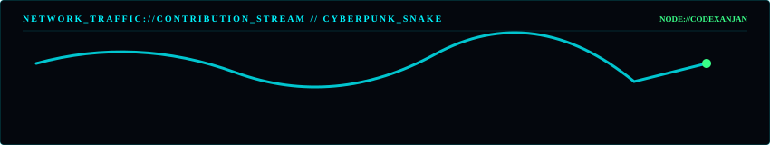
</picture>

 

  

<!-- ================================================================= -->
<!-- 09 // CERTIFICATIONS -->
<!-- ================================================================= -->


 

  

<!-- ================================================================= -->
<!-- 10 // ACHIEVEMENTS & MISSION LOGS -->
<!-- ================================================================= -->


 

  

<!-- ================================================================= -->
<!-- 11 // ACTIVE MISSIONS -->
<!-- ================================================================= -->


 

 

  

<!-- ================================================================= -->
<!-- 12 // CONNECTION PORT & SECURE CHANNEL -->
<!-- ================================================================= -->

  

  

<!-- CYBERPUNK STATUS BADGES -->

  
  &nbsp;
  
  &nbsp;
  
  &nbsp;
  
  &nbsp;
  

 

<!-- ================================================================= -->
<!-- TERMINAL FOOTER & STANDBY -->
<!-- ================================================================= -->

 

