<div align="center">

<!-- ======================================================== -->
<!-- 00 // HERO BANNER & IDENTITY                              -->
<!-- ======================================================== -->

<picture>
  <source media="(max-width: 768px)" srcset="./assets/ronin-hero-mobile.svg">
  
</picture>

<br/><br/>

<!-- ======================================================== -->
<!-- SYSTEM BOOT & TACTICAL STATUS                            -->
<!-- ======================================================== -->


<br/><br/>


<br/><br/>

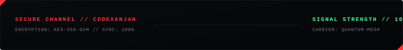

<br/><br/>

<!-- ======================================================== -->
<!-- KATANA DIVIDER 01                                        -->
<!-- ======================================================== -->


<br/><br/>

<!-- ======================================================== -->
<!-- 01 // WARRIOR PROFILE                                    -->
<!-- ======================================================== -->

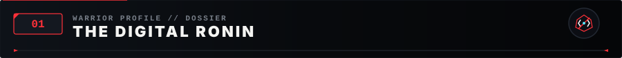

<br/><br/>


<br/><br/>


<br/><br/>

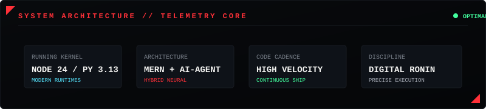

<br/><br/>

<!-- Bushido of Code: Four Disciplinary Pillars -->
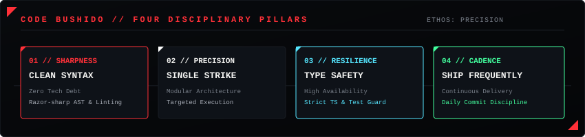

</div>

### Tactical Briefing // About Me

> **DISCIPLINE IN DESIGN. PRECISION IN CODE.**

I am **Anjan Shetty**, a developer focused on building scalable full-stack applications, intelligent systems, developer tools, and high-fidelity digital experiences.

My approach combines strong engineering fundamentals with continuous experimentation across modern web technologies, distributed backend architecture, AI/ML systems, and developer-focused products.

I build, test, break, refine, and ship.

```txt
CODENAME        :: CODEXANJAN
DISCIPLINE      :: FULL-STACK ARCHITECTURE & AI/ML SYSTEMS
PHILOSOPHY      :: SHARPEN CODE LIKE A KATANA BLADE
PRIMARY STACK   :: TYPESCRIPT // PYTHON // REACT // NODE.JS // DOCKER
```

---

<div align="center">

<!-- ======================================================== -->
<!-- KATANA DIVIDER 02                                        -->
<!-- ======================================================== -->


<br/><br/>

<!-- ======================================================== -->
<!-- 02 // TECH ARSENAL                                       -->
<!-- ======================================================== -->

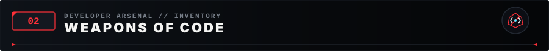

</div>

<p align="left"><em>A curated inventory of the languages, frameworks, and tools deployed across missions:</em></p>

### Languages

<p align="left">
  
</p>

### Frameworks & Libraries

<p align="left">
  
</p>

### Backend & APIs

<p align="left">
  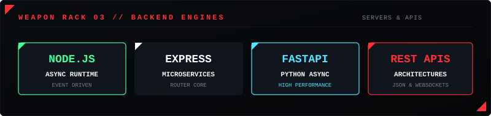
</p>

### Databases, Cloud & DevOps

<p align="left">
  
</p>

### Tools & Operations

<p align="left">
  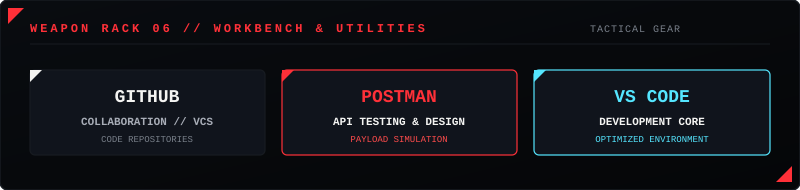
</p>

<div align="center">

<br/><br/>

<!-- ======================================================== -->
<!-- BLADE TRANSITION                                         -->
<!-- ======================================================== -->


<br/><br/>

<!-- ======================================================== -->
<!-- 03 // SELECTED MISSIONS                                  -->
<!-- ======================================================== -->

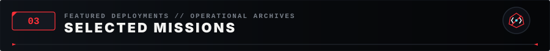

<br/><br/>

<!-- Mission 01: URLForge -->

</div>

<p align="center">
  <a href="https://github.com/codexanjan/URLForge" target="_blank">
    <code>[ MISSION ARCHIVE // URLFORGE REPOSITORY ]</code>
  </a>
  &nbsp;&nbsp;•&nbsp;&nbsp;
  <a href="https://github.com/codexanjan/URLForge" target="_blank">
    <code>[ LIVE DEPLOYMENT ]</code>
  </a>
</p>

<br/>

<div align="center">

<!-- Mission 02: PeriodicPortal -->
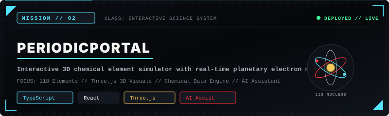

</div>

<p align="center">
  <a href="https://github.com/codexanjan/PeriodicPortal" target="_blank">
    <code>[ MISSION ARCHIVE // PERIODICPORTAL REPOSITORY ]</code>
  </a>
  &nbsp;&nbsp;•&nbsp;&nbsp;
  <a href="https://github.com/codexanjan/PeriodicPortal" target="_blank">
    <code>[ LIVE DEPLOYMENT ]</code>
  </a>
</p>

<br/>

<div align="center">

<!-- Mission 03: Markdown Studio -->

</div>

<p align="center">
  <a href="https://github.com/codexanjan/MarkdownStudio" target="_blank">
    <code>[ MISSION ARCHIVE // MARKDOWN STUDIO REPOSITORY ]</code>
  </a>
  &nbsp;&nbsp;•&nbsp;&nbsp;
  <a href="https://github.com/codexanjan/MarkdownStudio" target="_blank">
    <code>[ LIVE DEPLOYMENT ]</code>
  </a>
</p>

<br/>

<div align="center">

<!-- Mission 04: Smart Calendar -->
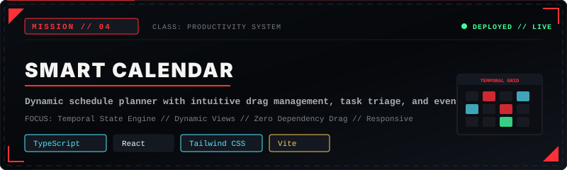

</div>

<p align="center">
  <a href="https://github.com/codexanjan/SmartCalendar" target="_blank">
    <code>[ MISSION ARCHIVE // SMART CALENDAR REPOSITORY ]</code>
  </a>
  &nbsp;&nbsp;•&nbsp;&nbsp;
  <a href="https://github.com/codexanjan/SmartCalendar" target="_blank">
    <code>[ LIVE DEPLOYMENT ]</code>
  </a>
</p>

<br/><br/>

<div align="center">

<!-- ======================================================== -->
<!-- KATANA DIVIDER 03                                        -->
<!-- ======================================================== -->


<br/><br/>

<!-- ======================================================== -->
<!-- 04 // INTELLIGENCE CORE                                  -->
<!-- ======================================================== -->

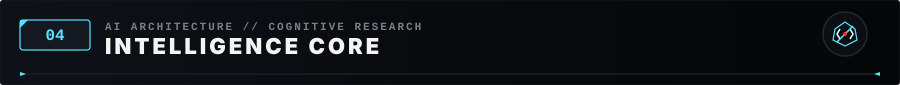

<br/><br/>


<br/><br/>

<!-- ======================================================== -->
<!-- KATANA DIVIDER 04                                        -->
<!-- ======================================================== -->


<br/><br/>

<!-- ======================================================== -->
<!-- 05 // SYSTEM TELEMETRY                                   -->
<!-- ======================================================== -->

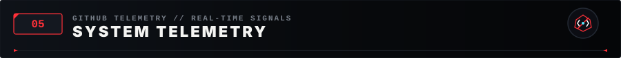

<br/><br/>


<br/><br/>


<br/><br/>

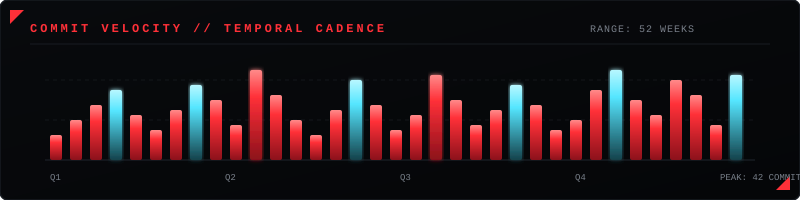

<br/><br/>


<br/><br/>

<!-- ======================================================== -->
<!-- KATANA DIVIDER 05                                        -->
<!-- ======================================================== -->


<br/><br/>

<!-- ======================================================== -->
<!-- 06 // CODE TRAIL // CONTRIBUTIONS                        -->
<!-- ======================================================== -->

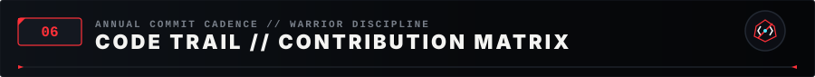

<br/><br/>


<br/><br/>

<!-- ======================================================== -->
<!-- KATANA DIVIDER 06                                        -->
<!-- ======================================================== -->


<br/><br/>

<!-- ======================================================== -->
<!-- 07 // RECORDS OF MASTERY                                 -->
<!-- ======================================================== -->

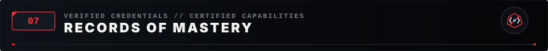

<br/><br/>


</div>

| Protocol | Discipline | Verification Node |
| :--- | :--- | :--- |
| `CERT-FS-2026` | Full-Stack Software Engineering | Systems Architecture & High-Scale Applications |
| `CERT-AI-889` | AI & Machine Learning Specialization | LLM Systems, Neural Networks & Agentic Automation |
| `CERT-OPS-410` | Cloud Infrastructure & DevOps | Docker Containers, Linux Kernels & CI/CD Pipelines |

<br/><br/>

<div align="center">

<!-- ======================================================== -->
<!-- 08 // BATTLE RECORDS                                     -->
<!-- ======================================================== -->

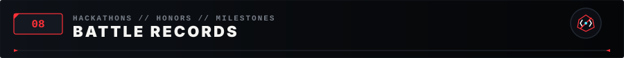

<br/><br/>


</div>

| Operational Milestone | Classification | Impact |
| :--- | :--- | :--- |
| `BATTLE-01` | Tactical Hackathons | Engineered and deployed complex full-stack solutions within high-pressure 48-hour sprint windows |
| `BATTLE-02` | Open-Source Engineering | Authored reusable developer tools, AST parsers, and interactive visualization engines |
| `BATTLE-03` | Systems & UX Craft | Designed zero-latency frontends and resilient event-driven microservices architectures |

<br/><br/>

<div align="center">

<!-- ======================================================== -->
<!-- KATANA DIVIDER 07                                        -->
<!-- ======================================================== -->


<br/><br/>

<!-- ======================================================== -->
<!-- 09 // OPEN CHANNEL // CONTACT                            -->
<!-- ======================================================== -->

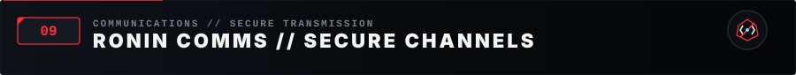

<br/><br/>


<br/><br/>

<p align="center">
  <a href="https://github.com/codexanjan" target="_blank">
    <code>[ GITHUB // @codexanjan ]</code>
  </a>
  &nbsp;&nbsp;•&nbsp;&nbsp;
  <a href="https://www.linkedin.com/in/anjan-shetty-67340026a/" target="_blank">
    <code>[ LINKEDIN // ANJAN SHETTY ]</code>
  </a>
  &nbsp;&nbsp;•&nbsp;&nbsp;
  <a href="mailto:anjanshetty.co@gmail.com">
    <code>[ SECURE TRANSMISSION // EMAIL ]</code>
  </a>
</p>

<br/><br/>

<!-- ======================================================== -->
<!-- MONOLITHIC RONIN FOOTER                                  -->
<!-- ======================================================== -->


<br/><br/>

```txt
[ TRANSMISSION END // CODEXANJAN // RONIN PROTOCOL 0x994 // ALL SYSTEMS ARMED ]
```

</div>
