<div align="center">

<!-- ======================================================== -->
<!-- 00 // HERO BANNER & IDENTITY                              -->
<!-- ======================================================== -->

<picture>
  <source media="(max-width: 768px)" srcset="./assets/ronin-hero-mobile-v2.svg">
  
</picture>

<br/><br/>

<!-- ======================================================== -->
<!-- SAMURAI TYPING TERMINAL & STATUS BADGES                  -->
<!-- ======================================================== -->

<a href="https://github.com/codexanjan">
  
</a>

<br/><br/>


<br/><br/>

<a href="https://github.com/codexanjan">
  
</a>

<br/><br/>

<!-- ======================================================== -->
<!-- KATANA DIVIDER 01                                        -->
<!-- ======================================================== -->


<br/><br/>

<!-- ======================================================== -->
<!-- 01 // WARRIOR PROFILE                                    -->
<!-- ======================================================== -->


<br/><br/>


<br/><br/>


</div>

<br/>

### ⚔️ The Way of Code // Samurai Creed & Philosophy

> *"A warrior sharpens the blade in stillness so that every strike in battle is decisive. A developer refines architecture in silence so that every deployment into production is indestructible."*

I am **Anjan Shetty** (`codexanjan`), an engineering craftsman walking the dual paths of **Full-Stack Software Architecture** and **Applied Artificial Intelligence**. 

To me, writing code is a discipline of **Bushido**:
- 🗡️ **Single-Strike Precision**: Zero bloated abstractions. Write modular, highly performant TypeScript and Python engineered for resilient scale.
- 🛡️ **Defensive Architecture**: Construct fault-tolerant distributed systems, bulletproof CI/CD pipelines, and robust cloud infrastructure that never yield under load.
- ⚡ **Continuous Mastery**: Relentlessly exploring modern runtimes, agentic LLM orchestration, deep neural networks, and zero-latency reactive user interfaces.

```txt
┌─── SAMURAI CODING DOSSIER ────────────────────────────────────────────────────────┐
│ OPERATIVE:   Anjan Shetty             CODENAME:   codexanjan                      │
│ PATH:        Full-Stack Architecture  DISCIPLINE: AI / ML Solutions Engineering   │
│ WEAPONS:     TypeScript & Python      STATUS:     Armed & Deployed                │
│ CREED:       Building in the dark. Shipping into the light.                       │
└───────────────────────────────────────────────────────────────────────────────────┘
```

---

<div align="center">

<!-- ======================================================== -->
<!-- KATANA DIVIDER 02                                        -->
<!-- ======================================================== -->


<br/><br/>

<!-- ======================================================== -->
<!-- 02 // TECH ARSENAL                                       -->
<!-- ======================================================== -->


</div>

<p align="left"><em>A curated inventory of the languages, frameworks, and tools deployed across missions:</em></p>

### Languages

<p align="left">
  
</p>

### Frameworks & Libraries

<p align="left">
  
</p>

### Backend & APIs

<p align="left">
  
</p>

### Databases, Cloud & DevOps

<p align="left">
  
</p>

### Tools & Operations

<p align="left">
  
</p>

<div align="center">

<br/><br/>

<!-- ======================================================== -->
<!-- BLADE TRANSITION                                         -->
<!-- ======================================================== -->


<br/><br/>

<!-- ======================================================== -->
<!-- 03 // PROJECT DATABASE // RONIN ARCHIVES                 -->
<!-- ======================================================== -->

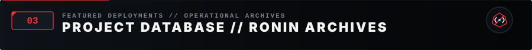

<br/><br/>

<a href="https://github.com/codexanjan/URLForge" target="_blank">
  
</a>

<br/><br/>

<a href="https://github.com/codexanjan/PeriodicPortal" target="_blank">
  
</a>

<br/><br/>

<a href="https://github.com/codexanjan/MarkdownStudio" target="_blank">
  
</a>

<br/><br/>

<a href="https://github.com/codexanjan/SmartCalendar" target="_blank">
  
</a>

</div>

<br/>

<table width="100%">
  <tr>
    <td width="50%" valign="top">
      <h4>🔗 <a href="https://github.com/codexanjan/URLForge" target="_blank">URLForge</a> // Link Forge &amp; Analytics Engine</h4>
      <p>High-performance URL shortener and link redirection architecture engineered for rapid dispatch, telemetry analytics, and clean RESTful design.</p>
      <ul>
        <li><strong>Focus:</strong> Fast URL resolution, link analytics &amp; clean API architecture</li>
        <li><strong>Stack:</strong> <code>TypeScript</code> <code>Node.js</code> <code>Express</code> <code>RESTful API</code></li>
        <li><strong>Repository:</strong> <a href="https://github.com/codexanjan/URLForge" target="_blank"><code>codexanjan/urlforge</code></a></li>
      </ul>
    </td>
    <td width="50%" valign="top">
      <h4>⚛️ <a href="https://github.com/codexanjan/PeriodicPortal" target="_blank">PeriodicPortal</a> // 3D Chemistry Hub</h4>
      <p>A modern educational web platform exploring all 118 chemical elements with glowing cards, 3D Bohr orbital models, trend analytics, and a built-in Chemistry AI chatbot.</p>
      <ul>
        <li><strong>Focus:</strong> 3D orbital visualization, chemical data &amp; conversational AI</li>
        <li><strong>Stack:</strong> <code>TypeScript</code> <code>React</code> <code>Three.js</code> <code>AI Integration</code></li>
        <li><strong>Repository:</strong> <a href="https://github.com/codexanjan/PeriodicPortal" target="_blank"><code>codexanjan/periodictable</code></a></li>
      </ul>
    </td>
  </tr>
  <tr>
    <td width="50%" valign="top">
      <h4>📝 <a href="https://github.com/codexanjan/MarkdownStudio" target="_blank">Markdown Studio</a> // Live Editor</h4>
      <p>Sleek browser-based Markdown studio offering real-time live preview, intelligent syntax highlighting, multi-format export tools, and productivity templates.</p>
      <ul>
        <li><strong>Focus:</strong> Real-time parser rendering, AST manipulation &amp; responsive UX</li>
        <li><strong>Stack:</strong> <code>TypeScript</code> <code>React</code> <code>Markdown Engine</code> <code>CSS Modules</code></li>
        <li><strong>Repository:</strong> <a href="https://github.com/codexanjan/MarkdownStudio" target="_blank"><code>codexanjan/markdown-editor</code></a></li>
      </ul>
    </td>
    <td width="50%" valign="top">
      <h4>📅 <a href="https://github.com/codexanjan/SmartCalendar" target="_blank">Smart Calendar</a> // Schedule Hub</h4>
      <p>Customizable personal scheduling platform built for calendar optimization, event management, and fluid user experience.</p>
      <ul>
        <li><strong>Focus:</strong> State orchestration, responsive calendar view &amp; UX architecture</li>
        <li><strong>Stack:</strong> <code>TypeScript</code> <code>React</code> <code>Tailwind CSS</code> <code>Vite</code></li>
        <li><strong>Repository:</strong> <a href="https://github.com/codexanjan/SmartCalendar" target="_blank"><code>codexanjan/smart-calender</code></a></li>
      </ul>
    </td>
  </tr>
</table>

<br/><br/>

<div align="center">

<!-- ======================================================== -->
<!-- KATANA DIVIDER 03                                        -->
<!-- ======================================================== -->


<br/><br/>

<!-- ======================================================== -->
<!-- 04 // COMMIT RADAR // CODE CADENCE                       -->
<!-- ======================================================== -->


<br/><br/>

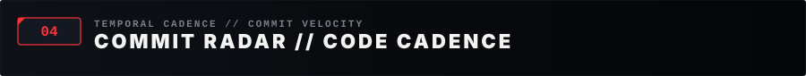

<br/><br/>

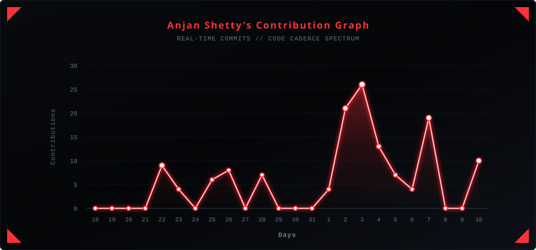

<br/><br/>

<a href="https://github.com/codexanjan" target="_blank">
  
</a>

<br/><br/>

<!-- ======================================================== -->
<!-- KATANA DIVIDER 04                                        -->
<!-- ======================================================== -->


<br/><br/>

<!-- ======================================================== -->
<!-- 05 // CONTRIBUTION PATROL // RONIN CADENCE               -->
<!-- ======================================================== -->


<br/><br/>


<br/><br/>

<!-- ======================================================== -->
<!-- KATANA DIVIDER 05                                        -->
<!-- ======================================================== -->


<br/><br/>

<!-- ======================================================== -->
<!-- 06 // 2026 MISSION DIRECTIVES // ROADMAP                 -->
<!-- ======================================================== -->

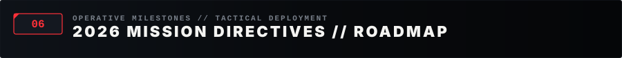

</div>

<br/>

<p><em>Operative milestones scheduled across the 2026 tactical deployment roadmap:</em></p>

- [x] 🚀 **Initialize Ronin Telemetry HUD**: Deploy interactive mainframe profile &amp; real-time analytics.
- [ ] 🧠 **2,000+ Algorithmic Directives**: Solve 2,000+ DSA problems across LeetCode, CodeWars, and GeeksforGeeks.
- [ ] 🏆 **5 Elite Hackathons**: Compete and architect high-impact solutions in national &amp; global hackathons.
- [ ] 🚀 **10 Production-Grade Systems**: Ship 10 resilient, scalable full-stack applications with CI/CD.
- [ ] 📈 **1,000 Sustained Contributions**: Maintain consistent open-source engineering cadence and commits.
- [ ] 🤖 **Deploy End-to-End AI SaaS**: Architect and launch a multi-tenant applied AI product solving real problems.

<br/>

<div align="center">

<br/>

<!-- ======================================================== -->
<!-- KATANA DIVIDER 06                                        -->
<!-- ======================================================== -->


<br/><br/>

<!-- ======================================================== -->
<!-- 07 // TROPHY ROOM // SAMURAI ACCOLADES                   -->
<!-- ======================================================== -->

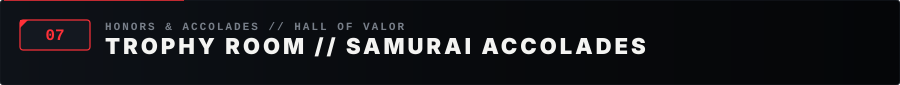

<br/><br/>

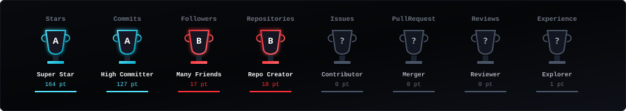

<br/><br/>

<!-- ======================================================== -->
<!-- KATANA DIVIDER 07                                        -->
<!-- ======================================================== -->


<br/><br/>

<!-- ======================================================== -->
<!-- 08 // RONIN TELEMETRY // MAINFRAME METRICS               -->
<!-- ======================================================== -->


</div>

<br/>

<p align="left"><em>Telemetry and code activity monitored through GitHub's analytical services:</em></p>

<div align="center">

<br/>

<a href="https://github.com/codexanjan">
  
</a>

<br/><br/>


<br/><br/>

<a href="https://github.com/codexanjan">
  
</a>

<br/><br/>

<p align="center">
  <a href="https://github.com/codexanjan" target="_blank">
    
  </a>
  &nbsp;&nbsp;
  <a href="https://github.com/codexanjan" target="_blank">
    
  </a>
</p>

<br/><br/>

<!-- ======================================================== -->
<!-- KATANA DIVIDER 08                                        -->
<!-- ======================================================== -->


<br/><br/>

<!-- ======================================================== -->
<!-- 09 // RONIN COMMS // SECURE CHANNELS                     -->
<!-- ======================================================== -->


</div>

<br/>

<p align="left"><em>Connect across developer networks and platforms:</em></p>

<div align="center">

<br/>

<a href="https://github.com/codexanjan" target="_blank">
  
</a>
<a href="https://twitter.com/anjxnshetty" target="_blank">
  
</a>
<a href="https://discord.com/users/codexanjan" target="_blank">
  
</a>
<a href="https://gitlab.com/codexanjan" target="_blank">
  
</a>
<a href="https://leetcode.com/u/anjanshetty" target="_blank">
  
</a>
<a href="https://www.codewars.com/users/codexanjan" target="_blank">
  
</a>
<a href="https://www.geeksforgeeks.org/profile/anjanshetty" target="_blank">
  
</a>
<a href="https://tryhackme.com/p/anjanshetty" target="_blank">
  
</a>
<a href="https://dev.to/anjanshetty" target="_blank">
  
</a>
<a href="https://stackoverflow.com/users/anjanshetty" target="_blank">
  
</a>
<a href="https://reddit.com/u/anjxnshetty" target="_blank">
  
</a>

<br/><br/>

<p><em>If you find value in my open-source work or want to support my technical journey:</em></p>

<a href="https://buymeacoffee.com/anjxnshetty" target="_blank">
  
</a>

<br/><br/>

<!-- ======================================================== -->
<!-- RONIN TERMINAL // COMMAND SHELL                          -->
<!-- ======================================================== -->

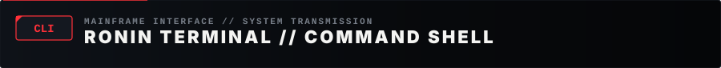

<br/><br/>


<br/><br/>

<p align="center">
  <a href="https://github.com/codexanjan" target="_blank">
    <code>[ GITHUB // @codexanjan ]</code>
  </a>
  &nbsp;&nbsp;•&nbsp;&nbsp;
  <a href="https://www.linkedin.com/in/anjan-shetty-67340026a/" target="_blank">
    <code>[ LINKEDIN // ANJAN SHETTY ]</code>
  </a>
  &nbsp;&nbsp;•&nbsp;&nbsp;
  <a href="mailto:anjanshetty.co@gmail.com">
    <code>[ SECURE TRANSMISSION // EMAIL ]</code>
  </a>
</p>

<br/><br/>

<!-- ======================================================== -->
<!-- FOOTER CREED TYPING TERMINAL                             -->
<!-- ======================================================== -->

<a href="https://github.com/codexanjan">
  
</a>

<br/><br/>

<!-- ======================================================== -->
<!-- MONOLITHIC RONIN FOOTER                                  -->
<!-- ======================================================== -->


<br/><br/>

```txt
[ TRANSMISSION END // CODEXANJAN // RONIN PROTOCOL 0x994 // ALL SYSTEMS ARMED ]
```

</div>
