<!-- ========================================================================= -->
<!-- 🕷️ ANJAN SHETTY // ORIGINAL SPIDER-VERSE DEVELOPER COMMAND CENTER       -->
<!-- DEVELOPER PORTFOLIO: ANJAN SHETTY (@codexanjan)                          -->
<!-- THEME: CYBERNETIC SPIDER × FUTURISTIC HUD × TERMINAL SYSTEMS             -->
<!-- ========================================================================= -->

<!--
       /\   /\
      //\\_//\\
      \_     _/
       / * * \
       \_\O/_/
    <!-- 🕷 You found the hidden web -->
    <!-- Great developers inspect the source 😎 -->
-->

<!--
╔═══════════════════════════════════════════════════════════════════════════╗
║                      CONFIGURATION & PLACEHOLDERS                         ║
║  Update the following references if customizing this README for your own  ║
║  account. Currently pre-configured for: codexanjan / Anjan Shetty        ║
║                                                                           ║
║  • GITHUB_USERNAME  : codexanjan                                         ║
║  • NAME             : Anjan Shetty                                        ║
║  • LINKEDIN_URL     : https://linkedin.com/in/YOUR_LINKEDIN_URL           ║
║  • PORTFOLIO_URL    : https://YOUR_PORTFOLIO_URL                          ║
║  • EMAIL            : anjanshetty.co@gmail.com                            ║
║  • WEATHERGPT_REPO  : https://github.com/codexanjan/WeatherGPT            ║
║  • AJ_RUNNER_REPO   : https://github.com/codexanjan/AJ-Runner             ║
║  • MOVIEREC_REPO    : https://github.com/codexanjan/Movie-Recommendation  ║
║  • PAYGUARD_REPO    : https://github.com/codexanjan/PayGuard              ║
╚═══════════════════════════════════════════════════════════════════════════╝
-->

<!-- ========================================================================= -->
<!-- 01 // ANIMATED HERO HEADER & ORIGINAL SPIDER LOGO                         -->
<!-- ========================================================================= -->

<div align="center">

<!-- ANIMATED WIDESCREEN HERO HEADER -->
<a href="https://github.com/codexanjan">
  <picture>
    <source media="(prefers-color-scheme: dark)" srcset="assets/spider-header.svg" />
    <source media="(prefers-color-scheme: light)" srcset="assets/spider-header.svg" />
    
  </picture>
</a>

<br/><br/>

<!-- ORIGINAL CYBERNETIC SPIDER EMBLEM (</> + AS MONOGRAM + 8 SEGMENTED LEGS) -->
<a href="https://github.com/codexanjan">
  
</a>

<br/>

<!-- CINEMATIC DEVELOPER TITLE -->
# ANJAN SHETTY

### `FULL STACK DEVELOPER` • `AI BUILDER` • `HACKATHON CREATOR`

<br/>

<!-- DYNAMIC TYPING ANIMATION -->
<a href="https://github.com/codexanjan">
  
</a>

<br/>

<!-- DEVELOPER BADGES -->
<p align="center">
  
  
  
  
</p>

</div>

<p align="center">
  
</p>

<!-- ========================================================================= -->
<!-- 02 // PROFILE INTRODUCTION & SUPERHERO TERMINAL CARD                      -->
<!-- ========================================================================= -->

# 🕸️ WHO'S BEHIND THE MASK?

Hey, I'm **Anjan Shetty** 👋 — a software engineer, full-stack architect, and AI explorer driven by a single core philosophy: **turn ambitious ideas into living, resilient digital products.**

I operate at the intersection of scalable backend engineering, high-fidelity interactive user interfaces, and applied artificial intelligence. Whether I'm decomposing complex architectural challenges into clean REST/gRPC endpoints, designing fluid 3D experiences with Three.js, or orchestrating multi-agent LLM reasoning pipelines, I approach software engineering as modern superpower architecture.

Hackathons and rapid prototyping are where I sharpen my edge: finding the core bottleneck under pressure, choosing battle-tested patterns, and shipping functional prototypes that leave a lasting impression.

<br/>

<div align="center">

<!-- SUPERHERO TERMINAL CARD -->
```yaml
name: Anjan Shetty
alias: Friendly Neighborhood Developer
role: Full Stack Developer & AI Builder
mission: Build technology people remember
current_focus:
  - Artificial Intelligence & LLM Pipelines
  - High-Throughput Full Stack Systems
  - Hackathons & Rapid Prototyping
  - Creative UI/UX & WebGL Interactions
status: Always Building // Signal Active
superpower: Turning ideas into production prototypes under crunch time
```

</div>

<p align="center">
  
</p>

<!-- ========================================================================= -->
<!-- 03 // DEVELOPER IDENTITY CARDS                                            -->
<!-- ========================================================================= -->

# 🕷️ DEVELOPER IDENTITY

<table width="100%">
  <tr>
    <td width="50%" valign="top">
      <h3>⚡ CARD 01 // FULL STACK BUILDER</h3>
      <p>I build complete, end-to-end applications from responsive, tactile frontend experiences to reliable, distributed backend architectures and persistent data stores.</p>
    </td>
    <td width="50%" valign="top">
      <h3>🤖 CARD 02 // AI EXPLORER</h3>
      <p>Exploring the frontier of intelligent software: wiring LLM tool calling, autonomous agent reasoning loops, vector retrieval (RAG), and applied machine learning models into real workflows.</p>
    </td>
  </tr>
  <tr>
    <td width="50%" valign="top">
      <h3>🎨 CARD 03 // UI/UX CREATOR</h3>
      <p>Building interfaces that are as thrilling to interact with as they are functional. Design is never an afterthought — it's how technology respects the human user.</p>
    </td>
    <td width="50%" valign="top">
      <h3>🏆 CARD 04 // HACKATHON BUILDER</h3>
      <p>Thriving under ticking clocks: rapidly converting wild concepts into validated, working prototypes with clean code, solid APIs, and compelling pitch narratives.</p>
    </td>
  </tr>
  <tr>
    <td colspan="2" valign="top">
      <h3>🧠 CARD 05 // PROBLEM SOLVER</h3>
      <p>Breaking intricate technical challenges into simple, maintainable, and scalable primitives. Every bug has an origin story, and clean architecture is an invisible superpower.</p>
    </td>
  </tr>
</table>

<p align="center">
  
</p>

<!-- ========================================================================= -->
<!-- 04 // TECH ARSENAL                                                        -->
<!-- ========================================================================= -->

## ⚡ TECH ARSENAL

### *Superpower equipment caught in my technical web.*

<div align="center">

#### 🔤 PROGRAMMING LANGUAGES
<a href="https://skillicons.dev">
  
</a>

<br/>

#### 🎨 FRONTEND FRAMEWORKS & DESIGN
<a href="https://skillicons.dev">
  
</a>

<br/>

#### ⚙️ BACKEND & API ENGINES
<a href="https://skillicons.dev">
  
</a>

<br/>

#### 💾 DATABASES & STORAGE
<a href="https://skillicons.dev">
  
</a>

<br/>

#### 🤖 AI, MACHINE LEARNING & LLM PIPELINES
<a href="https://skillicons.dev">
  
</a>

<br/>

#### 🛠️ DEVOPS, CLOUD & WORKSPACE TOOLS
<a href="https://skillicons.dev">
  
</a>

</div>

<p align="center">
  
</p>

<!-- ========================================================================= -->
<!-- 05 // CURRENTLY BUILDING                                                  -->
<!-- ========================================================================= -->

## 🚀 CURRENTLY BUILDING

<table width="100%">
  <tr>
    <td width="33%" valign="top">
      <h3 align="left">🌦️ WeatherGPT</h3>
      <p><b>AI-Powered Weather Risk Platform</b></p>
      <p>Synthesizes multi-source meteorological sensor data with machine learning to predict hazardous risks, run what-if simulations, and generate real-time emergency advisories.</p>
      <ul>
        <li>Weather risk insights</li>
        <li>AI explanations &amp; diagnostics</li>
        <li>What-if weather simulations</li>
        <li>Location-based emergency alerts</li>
      </ul>
      <p><b>Stack:</b> <code>React</code> • <code>Python</code> • <code>FastAPI</code> • <code>ML</code></p>
    </td>
    <td width="33%" valign="top">
      <h3 align="left">🏃 AJ Runner</h3>
      <p><b>Modern Web Arcade Runner Game</b></p>
      <p>A high-velocity arcade runner built on HTML5 Canvas and WebGL, featuring physics simulations, responsive keyboard controls, obstacles, and combo multipliers.</p>
      <ul>
        <li>Responsive 60 FPS gameplay</li>
        <li>Keyboard controls &amp; dash mechanics</li>
        <li>Dynamic scoring &amp; missions</li>
        <li>Customizable avatars &amp; trails</li>
      </ul>
      <p><b>Stack:</b> <code>JavaScript</code> • <code>Canvas</code> • <code>WebGL</code> • <code>CSS3</code></p>
    </td>
    <td width="33%" valign="top">
      <h3 align="left">🎬 Movie Recommender</h3>
      <p><b>Intelligent Cinematic Discovery</b></p>
      <p>A smart discovery engine calculating vector cosine similarities across movie metadata to deliver personalized, mood-based, and explainable movie recommendations.</p>
      <ul>
        <li>Personalized recommendations</li>
        <li>Mood-based filtering</li>
        <li>Similarity vector engine</li>
        <li>Cinematic dark UI/UX</li>
      </ul>
      <p><b>Stack:</b> <code>Python</code> • <code>Scikit-learn</code> • <code>React</code> • <code>REST</code></p>
    </td>
  </tr>
</table>

<br/>

<!-- ========================================================================= -->
<!-- 06 // FEATURED MISSIONS                                                   -->
<!-- ========================================================================= -->

## 🕸️ FEATURED MISSIONS

<table width="100%">
  <tr>
    <td width="50%" valign="top">
      <h3 align="left">🌦️ <a href="https://github.com/codexanjan/WeatherGPT">WeatherGPT</a></h3>
      <p><code>MISSION_01</code> // </p>
      <p>AI-driven atmospheric risk forecasting engine with interactive diagnostic simulations and transparent decision factors.</p>
      <p><b>Tech:</b> <code>Python</code> • <code>React</code> • <code>FastAPI</code> • <code>Scikit-learn</code></p>
      <p align="center">
        <a href="https://github.com/codexanjan/WeatherGPT">
          
        </a>
        <a href="https://github.com/codexanjan/WeatherGPT">
          
        </a>
      </p>
    </td>
    <td width="50%" valign="top">
      <h3 align="left">🛡️ <a href="https://github.com/codexanjan/PayGuard">PayGuard</a></h3>
      <p><code>MISSION_02</code> // </p>
      <p>Real-time UPI payment fraud shield detecting transaction anomalies with sub-second ML scoring and admin telemetry.</p>
      <p><b>Tech:</b> <code>Python</code> • <code>Machine Learning</code> • <code>React</code> • <code>FastAPI</code></p>
      <p align="center">
        <a href="https://github.com/codexanjan/PayGuard">
          
        </a>
        <a href="https://github.com/codexanjan/PayGuard">
          
        </a>
      </p>
    </td>
  </tr>
  <tr>
    <td width="50%" valign="top">
      <h3 align="left">🏃 <a href="https://github.com/codexanjan/AJ-Runner">AJ Runner</a></h3>
      <p><code>MISSION_03</code> // </p>
      <p>Fast-paced browser platform runner with procedural obstacle generation, collectible power-ups, and animated cyberpunk HUD.</p>
      <p><b>Tech:</b> <code>JavaScript</code> • <code>HTML5 Canvas</code> • <code>WebGL</code> • <code>CSS3</code></p>
      <p align="center">
        <a href="https://github.com/codexanjan/AJ-Runner">
          
        </a>
        <a href="https://github.com/codexanjan/AJ-Runner">
          
        </a>
      </p>
    </td>
    <td width="50%" valign="top">
      <h3 align="left">⚛️ <a href="https://github.com/codexanjan/periodictable">PeriodicPortal</a></h3>
      <p><code>MISSION_04</code> // </p>
      <p>Interactive 3D chemical element visualizer with animated electron orbital clouds and natural language conversational AI guidance.</p>
      <p><b>Tech:</b> <code>TypeScript</code> • <code>React</code> • <code>Three.js</code> • <code>AI APIs</code></p>
      <p align="center">
        <a href="https://github.com/codexanjan/periodictable">
          
        </a>
        <a href="https://github.com/codexanjan/periodictable">
          
        </a>
      </p>
    </td>
  </tr>
</table>

<p align="center">
  
</p>

<!-- ========================================================================= -->
<!-- 07 // ACHIEVEMENTS UNLOCKED & CUSTOM BADGES                               -->
<!-- ========================================================================= -->

# 🏆 ACHIEVEMENTS UNLOCKED

<div align="center">

<a href="https://github.com/codexanjan">
  
</a>

</div>

<br/>

<table width="100%">
  <tr>
    <td width="33%" valign="top">
      <h3>🏆 HACKATHON FINALIST</h3>
      <p><b>Rapid Innovation Sprint</b></p>
      <p>Engineered and deployed an end-to-end intelligent software prototype within a strict competitive sprint, recognized for technical depth and UI execution.</p>
      <p><code>ACHIEVEMENT_ID: HK-FIN-01</code></p>
    </td>
    <td width="33%" valign="top">
      <h3>🥇 PROJECT MILESTONE</h3>
      <p><b>Production Full-Stack Architecture</b></p>
      <p>Architected and launched full-stack applications with integrated automated tests, continuous deployment pipelines, and sub-second response times.</p>
      <p><code>ACHIEVEMENT_ID: PRJ-MLS-02</code></p>
    </td>
    <td width="33%" valign="top">
      <h3>🔥 BUILD STREAK</h3>
      <p><b>Consistent Code Craft</b></p>
      <p>Maintained consistent daily problem-solving, open-source commits, and feature releases across web engineering and machine learning domains.</p>
      <p><code>ACHIEVEMENT_ID: STRK-99-03</code></p>
    </td>
  </tr>
</table>

<br/>

### 🎖️ SUPERHERO DEVELOPER BADGES
<p align="center">
  
  
  
  
  
</p>

<p align="center">
  
</p>

<!-- ========================================================================= -->
<!-- 08 // CERTIFICATION VAULT                                                 -->
<!-- ========================================================================= -->

# 📜 CERTIFICATION VAULT

<table width="100%">
  <tr>
    <td width="50%" valign="top">
      <h3>🐍 Python Programming &amp; Data Structures</h3>
      <p><b>Issuer:</b> <code>CERTIFICATE_ISSUER</code></p>
      <p><b>Issued:</b> <code>DATE_ISSUED</code> • <b>Credential ID:</b> <code>CREDENTIAL_ID_01</code></p>
      <p><b>Skills:</b> Python • Algorithms • Object-Oriented Design • Data Structures</p>
      <p><a href="CERTIFICATE_URL_01"><b>[ 🔗 View Verified Credential ]</b></a></p>
    </td>
    <td width="50%" valign="top">
      <h3>🌐 Full Stack Web Development Architecture</h3>
      <p><b>Issuer:</b> <code>CERTIFICATE_ISSUER</code></p>
      <p><b>Issued:</b> <code>DATE_ISSUED</code> • <b>Credential ID:</b> <code>CREDENTIAL_ID_02</code></p>
      <p><b>Skills:</b> React • Node.js • Express • REST APIs • MongoDB</p>
      <p><a href="CERTIFICATE_URL_02"><b>[ 🔗 View Verified Credential ]</b></a></p>
    </td>
  </tr>
  <tr>
    <td width="50%" valign="top">
      <h3>🤖 Applied Machine Learning &amp; AI Systems</h3>
      <p><b>Issuer:</b> <code>CERTIFICATE_ISSUER</code></p>
      <p><b>Issued:</b> <code>DATE_ISSUED</code> • <b>Credential ID:</b> <code>CREDENTIAL_ID_03</code></p>
      <p><b>Skills:</b> Supervised Learning • Neural Networks • Scikit-learn • Model Evaluation</p>
      <p><a href="CERTIFICATE_URL_03"><b>[ 🔗 View Verified Credential ]</b></a></p>
    </td>
    <td width="50%" valign="top">
      <h3>☁️ Cloud Infrastructure &amp; Containerization</h3>
      <p><b>Issuer:</b> <code>CERTIFICATE_ISSUER</code></p>
      <p><b>Issued:</b> <code>DATE_ISSUED</code> • <b>Credential ID:</b> <code>CREDENTIAL_ID_04</code></p>
      <p><b>Skills:</b> Docker • Git/GitHub Workflows • CI/CD Automation • Cloud Deployment</p>
      <p><a href="CERTIFICATE_URL_04"><b>[ 🔗 View Verified Credential ]</b></a></p>
    </td>
  </tr>
</table>

<p align="center">
  
</p>

<!-- ========================================================================= -->
<!-- 09 // DEVELOPER ANALYTICS & TROPHY ROOM                                   -->
<!-- ========================================================================= -->

# 📊 DEVELOPER ANALYTICS

<div align="center">

<!-- GITHUB STATS & TOP LANGUAGES -->
<p align="center">
  
  
</p>

<br/>

<!-- STREAK TRACKER -->
<p align="center">
  
</p>

</div>

<br/>

<!-- TROPHY ROOM -->
# 🏆 TROPHY ROOM

<div align="center">

<a href="https://github.com/codexanjan">
  
</a>

</div>

<br/>

<!-- CONTRIBUTION NETWORK (SNAKE) -->
# 🐍 CONTRIBUTION NETWORK

> ### *"Even my contributions know how to crawl the web."*

<div align="center">

<picture>
  <source media="(prefers-color-scheme: dark)" srcset="https://raw.githubusercontent.com/codexanjan/codexanjan/output/github-contribution-grid-snake-dark.svg" />
  <source media="(prefers-color-scheme: light)" srcset="https://raw.githubusercontent.com/codexanjan/codexanjan/output/github-contribution-grid-snake.svg" />
  
</picture>

</div>

<br/>

<!-- CODING WEB / TOPOLOGY -->
## 🕸️ MY CODING WEB

<div align="center">


<br/><br/>

<!-- ACTIVITY GRAPH -->


</div>

<p align="center">
  
</p>

<!-- ========================================================================= -->
<!-- 10 // HACKATHON JOURNEY & LEARNING ARC                                    -->
<!-- ========================================================================= -->

# 🚀 HACKATHON JOURNEY

```text
  [ IDEA ]  ──►  Decompose real customer pain points into modular primitives
     │
     ▼
[ RESEARCH ] ──►  Benchmark technical feasibility & select battle-tested stacks
     │
     ▼
[ PROTOTYPE ]──►  Wire frontend interfaces to mock APIs in under 2 hours
     │
     ▼
  [ BUILD ]  ──►  Implement reliable state management, server controllers & DB
     │
     ▼
  [ DEBUG ]  ──►  Isolate race conditions, test edge cases & optimize queries
     │
     ▼
  [ PITCH ]  ──►  Structure a razor-sharp demo highlighting user impact
     │
     ▼
  [ SHIP ]   ──►  Deploy live production URLs before the final gong 🚀
```

<br/>

# 🧠 CURRENT LEARNING ARC

```text
AI AGENTS & LLM PIPELINES   █████████░  [ 90% // TOOL USE • RAG • MULTI-AGENT ]
FULL STACK ARCHITECTURE     ████████░░  [ 80% // NEXT.JS • FASTAPI • MICROSERVICES ]
HIGH-FIDELITY UI/UX & 3D    ███████░░░  [ 75% // THREE.JS • TAILWIND • SHADERS ]
MACHINE LEARNING FOUNDATIONS██████░░░░  [ 65% // PYTORCH • MODEL FINE-TUNING ]
DISTRIBUTED SYSTEM DESIGN   ███████░░░  [ 70% // CACHING • LOAD BALANCING ]
```

<p align="center">
  
</p>

<!-- ========================================================================= -->
<!-- 11 // WHAT MAKES ME DIFFERENT: MY DEVELOPER DNA                           -->
<!-- ========================================================================= -->

# 🕷️ MY DEVELOPER DNA

- ⚡ **I combine technical development with creative presentation:** Code that functions perfectly should feel intuitive, dynamic, and delightful to touch.
- 🧠 **I convert ambitious ideas into practical prototypes:** Theory without working execution is incomplete; I prioritize tangible, testable software.
- 🎨 **I focus heavily on UI/UX:** Frontend design is never an afterthought — it's the primary medium through which users experience your architecture.
- 🤖 **I explore applied AI pragmatically:** I focus on how LLMs and ML can augment real workflows rather than chasing buzzwords.
- 🏆 **I thrive in hackathon environments:** High-pressure sprints breed clarity of thought, rapid prioritization, and team synergy.
- 🚀 **I build software people actually interact with:** From educational 3D platforms to fraud prevention shields, real-world utility comes first.
- 🕸️ **I continuously experiment:** Software engineering is an infinite web of discovery, and I'm always swinging toward the next horizon.

<br/>

<!-- ========================================================================= -->
<!-- 12 // SIGNAL FROM THE MULTIVERSE & EASTER EGGS                            -->
<!-- ========================================================================= -->

## 💭 SIGNAL FROM THE MULTIVERSE

> 🕷️ *"With powerful code comes the responsibility to build something meaningful."*  
> ⚡ *"Anyone can write code. The real superpower is solving the right problem."*  
> 🌐 *"Web developer. Literally."*  
> 🎯 *"Production is my final boss."*

<br/>

<!-- ========================================================================= -->
<!-- 13 // CONNECT TO THE WEB                                                  -->
<!-- ========================================================================= -->

# 🌐 CONNECT TO THE WEB

Got an ambitious idea, open-source project, or technical opportunity? Send a signal across the digital web:

<p align="center">
  <a href="https://github.com/codexanjan">
    
  </a>
  &nbsp;
  <a href="https://linkedin.com/in/YOUR_LINKEDIN_URL">
    
  </a>
  &nbsp;
  <a href="https://x.com/anjxnshetty">
    
  </a>
  &nbsp;
  <a href="mailto:anjanshetty.co@gmail.com">
    
  </a>
  &nbsp;
  <a href="https://YOUR_PORTFOLIO_URL">
    
  </a>
</p>

<br/>

<!-- PROFILE SIGNALS / VISITOR COUNTER -->
<div align="center">

### 👁️ PROFILE SIGNALS

<a href="https://github.com/codexanjan">
  
</a>

</div>

<br/>

<!-- ========================================================================= -->
<!-- 14 // CINEMATIC FOOTER                                                    -->
<!-- ========================================================================= -->

<div align="center">

```text
╔══════════════════════════════════════════════════════════════════════════╗
║                                                                          ║
║              WITH POWERFUL CODE COMES THE RESPONSIBILITY                 ║
║                    TO BUILD SOMETHING MEANINGFUL.                        ║
║                                                                          ║
║                     ANJAN SHETTY // EARTH-CODEX-01                       ║
║                                                                          ║
╚══════════════════════════════════════════════════════════════════════════╝
```


### Built with ❤️ + ☕ + Code by **Anjan Shetty**

<p align="center">
  
</p>

`SIGNAL TRANSMISSION COMPLETE // UNTIL THE NEXT COMMIT`

</div>
