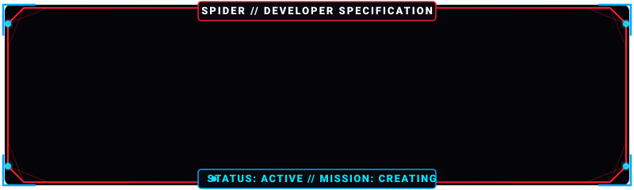
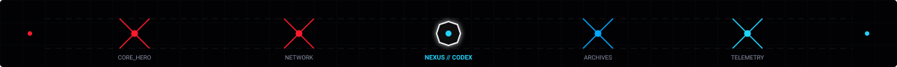
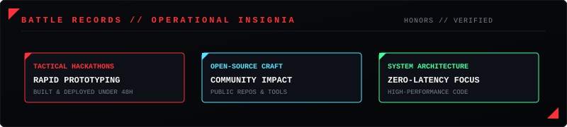
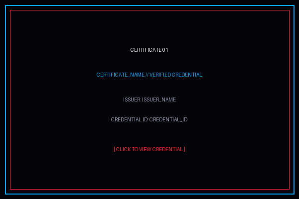
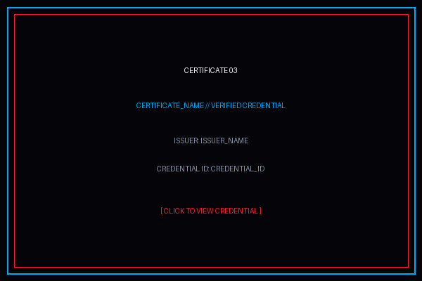

<!-- THE WEB BELONGS TO CODEXANJAN -->
<!-- Great developers inspect the source. -->
<!--
       /\   /\
      //\\_//\\
      \_     _/
       / * * \
       \_/O\_/
    NODE: EARTH-CODEX-01 // ANJAN SHETTY // @codexanjan
    PROTOCOL: SPIDER-VERSE DEVELOPER COMMAND CENTER
-->

<div align="center">

<!-- ========================================================================= -->
<!-- 01 // HERO                                                                -->
<!-- ========================================================================= -->

<!-- HERO WIDESCREEN CINEMATIC HEADER -->
<picture>
  <source media="(prefers-color-scheme: dark)" srcset="assets/anjan-hero.svg" />
  <source media="(prefers-color-scheme: light)" srcset="assets/anjan-hero.svg" />
  
</picture>

<br/><br/>

<!-- ORIGINAL DEVELOPER SPIDER EMBLEM -->
<a href="https://github.com/codexanjan">
  
</a>

<!-- ADD_SPIDERMAN_ASSET_HERE: assets/spiderman-heading.gif or assets/spiderman-logo.png -->

<br/><br/>


</div>

<br/>

<!-- ========================================================================= -->
<!-- 02 // ABOUT ME                                                            -->
<!-- ========================================================================= -->

##  ABOUT ME

I am Anjan Shetty, a developer focused on building intelligent, practical, and visually distinctive digital products.

I enjoy combining technology, design, and rapid experimentation to turn ideas into working systems.

**Core interests:**
-  Full Stack Development
-  Artificial Intelligence
-  Modern UI/UX
-  Hackathon Development
-  Creative Engineering
-  Product Development

<!-- ADD_SPIDERMAN_ASSET_HERE: assets/spiderman-action.gif -->

<br/>

<div align="center">

<!-- DEVELOPER TERMINAL CARD WITH SPIDER FRAME -->
<picture>
  <source media="(prefers-color-scheme: dark)" srcset="assets/spider-frame.svg" />
  <source media="(prefers-color-scheme: light)" srcset="assets/spider-frame.svg" />
  
</picture>

```yaml
name: Anjan Shetty
github: codexanjan
role: Full Stack Developer
focus:
  - Artificial Intelligence
  - Web Development
  - Product Building
  - Hackathons
approach: Build. Test. Improve.
status: Creating
```


</div>

<br/>

<!-- ========================================================================= -->
<!-- 03 // SPIDER NETWORK                                                      -->
<!-- ========================================================================= -->

##  SPIDER NETWORK

<div align="center">



</div>

<table width="100%">
  <tr>
    <td width="50%" valign="top">
      <h3> CARD 01 // BUILD</h3>
      <p><b>Turn ambitious ideas into functional prototypes.</b></p>
      <p>Decomposing complex requirements into clean architectural primitives, robust APIs, and resilient data flows that execute under demanding production conditions.</p>
    </td>
    <td width="50%" valign="top">
      <h3> CARD 02 // DESIGN</h3>
      <p><b>Make functionality and presentation work together.</b></p>
      <p>Designing interfaces that feel tactile, responsive, and intuitive. Visual polish is not an afterthought; it is how software respects human attention.</p>
    </td>
  </tr>
  <tr>
    <td width="50%" valign="top">
      <h3> CARD 03 // INTELLIGENCE</h3>
      <p><b>Use AI where it genuinely improves a product.</b></p>
      <p>Integrating LLM pipelines, autonomous tool calling, and vector retrieval into practical workflows that deliver measurable leverage rather than superficial novelty.</p>
    </td>
    <td width="50%" valign="top">
      <h3> CARD 04 // ITERATE</h3>
      <p><b>Build, test, improve, repeat.</b></p>
      <p>Rapid feedback loops, ruthless refactoring, and disciplined continuous integration to ensure every deploy is measurably superior to the previous release.</p>
    </td>
  </tr>
</table>

<div align="center">
  
</div>

<br/>

<!-- ========================================================================= -->
<!-- 04 // TECH ARSENAL                                                        -->
<!-- ========================================================================= -->

##  TECH ARSENAL

<div align="center">

#### LANGUAGES
<a href="https://skillicons.dev">
  
</a>

<br/><br/>

#### FRONTEND
<a href="https://skillicons.dev">
  
</a>

<br/><br/>

#### BACKEND
<a href="https://skillicons.dev">
  
</a>

<br/><br/>

#### DATABASES
<a href="https://skillicons.dev">
  
</a>

<br/><br/>

#### ARTIFICIAL INTELLIGENCE
<a href="https://skillicons.dev">
  
</a>

<br/><br/>

#### TOOLS &amp; WORKSPACE
<a href="https://skillicons.dev">
  
</a>

<br/><br/>


</div>

<br/>

<!-- ========================================================================= -->
<!-- 05 // SPIDER-VERSE MISSIONS                                                 -->
<!-- ========================================================================= -->

##  SPIDER-VERSE MISSIONS

<div align="center">
  
</div>

<br/>

<table width="100%">
  <tr>
    <td width="33%" valign="top">
      <h3> WEATHERGPT</h3>
      <p><code>STATUS: ACTIVE</code></p>
      <p><b>AI-powered weather risk intelligence platform.</b></p>
      <p>Synthesizes meteorological sensor feeds with predictive machine learning to forecast hazardous weather phenomena and automate emergency advisories.</p>
      <ul>
        <li>AI weather explanations</li>
        <li>Risk intelligence</li>
        <li>What-if simulations</li>
        <li>Personalized emergency alerts</li>
        <li>Disaster preparedness</li>
        <li>Smart recommendations</li>
      </ul>
      <p><b>Tech:</b> <code>Python</code> | <code>React</code> | <code>FastAPI</code> | <code>ML</code></p>
      <p>
        <a href="https://github.com/codexanjan/atmosphere"><b>[ REPOSITORY ]</b></a> | 
        <a href="https://github.com/codexanjan/atmosphere"><b>[ LIVE DEMO ]</b></a>
      </p>
    </td>
    <td width="33%" valign="top">
      <h3> AJ RUNNER</h3>
      <p><code>STATUS: ACTIVE</code></p>
      <p><b>Original endless-runner game featuring AJ.</b></p>
      <p>A high-velocity arcade runner built on HTML5 Canvas and WebGL, featuring responsive physics simulations, procedural obstacle generation, and dynamic mechanics.</p>
      <ul>
        <li>Responsive controls</li>
        <li>Obstacles</li>
        <li>Collectibles</li>
        <li>Score system</li>
        <li>Smooth movement</li>
        <li>Responsive UI</li>
      </ul>
      <p><b>Tech:</b> <code>JavaScript</code> | <code>HTML5 Canvas</code> | <code>WebGL</code> | <code>CSS3</code></p>
      <p>
        <a href="https://github.com/codexanjan/AJ-RUNNER"><b>[ REPOSITORY ]</b></a> | 
        <a href="https://github.com/codexanjan/AJ-RUNNER"><b>[ LIVE DEMO ]</b></a>
      </p>
    </td>
    <td width="33%" valign="top">
      <h3> NEXUSVAULT</h3>
      <p><code>STATUS: ACTIVE</code></p>
      <p><b>Security and credential storage platform.</b></p>
      <p>A robust TypeScript and encrypted credential management vault engineered for zero-compromise credential security, rapid access tokens, and modular extensibility.</p>
      <ul>
        <li>Encrypted credential vaults</li>
        <li>Token management</li>
        <li>Zero-knowledge design</li>
        <li>Rapid retrieval engine</li>
        <li>Security auditing</li>
        <li>Cyber HUD interface</li>
      </ul>
      <p><b>Tech:</b> <code>TypeScript</code> | <code>Node.js</code> | <code>Cryptography</code> | <code>Security</code></p>
      <p>
        <a href="https://github.com/codexanjan/nexusvault"><b>[ REPOSITORY ]</b></a> | 
        <a href="https://github.com/codexanjan/nexusvault"><b>[ LIVE DEMO ]</b></a>
      </p>
    </td>
  </tr>
</table>

<div align="center">
  
</div>

<br/>

<!-- ========================================================================= -->
<!-- 06 // SPIDER-VERSE ACHIEVEMENTS                                             -->
<!-- ========================================================================= -->

##  SPIDER-VERSE ACHIEVEMENTS

<div align="center">
  
</div>

<br/>

<table width="100%">
  <tr>
    <td width="50%" valign="top">
      <h3> ACHIEVEMENT_TITLE</h3>
      <p><b>Organization:</b> ORGANIZATION</p>
      <p><b>Date:</b> DATE</p>
      <p><b>Result:</b> RESULT</p>
      <p><a href="ACHIEVEMENT_URL"><b>[ VIEW VERIFIED RECORD ]</b></a></p>
    </td>
    <td width="50%" valign="top">
      <h3> ACHIEVEMENT_TITLE</h3>
      <p><b>Organization:</b> ORGANIZATION</p>
      <p><b>Date:</b> DATE</p>
      <p><b>Result:</b> RESULT</p>
      <p><a href="ACHIEVEMENT_URL"><b>[ VIEW VERIFIED RECORD ]</b></a></p>
    </td>
  </tr>
  <tr>
    <td width="50%" valign="top">
      <h3> ACHIEVEMENT_TITLE</h3>
      <p><b>Organization:</b> ORGANIZATION</p>
      <p><b>Date:</b> DATE</p>
      <p><b>Result:</b> RESULT</p>
      <p><a href="ACHIEVEMENT_URL"><b>[ VIEW VERIFIED RECORD ]</b></a></p>
    </td>
    <td width="50%" valign="top">
      <h3> ACHIEVEMENT_TITLE</h3>
      <p><b>Organization:</b> ORGANIZATION</p>
      <p><b>Date:</b> DATE</p>
      <p><b>Result:</b> RESULT</p>
      <p><a href="ACHIEVEMENT_URL"><b>[ VIEW VERIFIED RECORD ]</b></a></p>
    </td>
  </tr>
</table>

<div align="center">
  
</div>

<br/>

<!-- ========================================================================= -->
<!-- 07 // SPIDER-VERSE CREDENTIAL VAULT                                           -->
<!-- ========================================================================= -->

##  SPIDER-VERSE CREDENTIAL VAULT

<div align="center">
  
</div>

<br/>

<table width="100%">
  <tr>
    <td width="33%" valign="top" align="center">
      <a href="CERTIFICATE_URL">
        
      </a>
      <br/><br/>
      <h4 align="left">CERTIFICATE_NAME</h4>
      <p align="left">
        <b>Issuer:</b> ISSUER_NAME<br/>
        <b>Date:</b> ISSUED_DATE<br/>
        <b>Credential ID:</b> <code>CREDENTIAL_ID</code><br/>
        <b>Skills:</b> Technical Mastery<br/>
        <a href="CERTIFICATE_URL"><b>[ VERIFY CERTIFICATE ]</b></a>
      </p>
    </td>
    <td width="33%" valign="top" align="center">
      <a href="CERTIFICATE_URL">
        
      </a>
      <br/><br/>
      <h4 align="left">CERTIFICATE_NAME</h4>
      <p align="left">
        <b>Issuer:</b> ISSUER_NAME<br/>
        <b>Date:</b> ISSUED_DATE<br/>
        <b>Credential ID:</b> <code>CREDENTIAL_ID</code><br/>
        <b>Skills:</b> Technical Mastery<br/>
        <a href="CERTIFICATE_URL"><b>[ VERIFY CERTIFICATE ]</b></a>
      </p>
    </td>
    <td width="33%" valign="top" align="center">
      <a href="CERTIFICATE_URL">
        
      </a>
      <br/><br/>
      <h4 align="left">CERTIFICATE_NAME</h4>
      <p align="left">
        <b>Issuer:</b> ISSUER_NAME<br/>
        <b>Date:</b> ISSUED_DATE<br/>
        <b>Credential ID:</b> <code>CREDENTIAL_ID</code><br/>
        <b>Skills:</b> Technical Mastery<br/>
        <a href="CERTIFICATE_URL"><b>[ VERIFY CERTIFICATE ]</b></a>
      </p>
    </td>
  </tr>
</table>

<div align="center">
  
</div>

<br/>

<!-- ========================================================================= -->
<!-- 08 // SPIDER-VERSE COMMAND CENTER                                                  -->
<!-- ========================================================================= -->

##  SPIDER-VERSE COMMAND CENTER

<div align="center">



<br/><br/>

<!-- TOP LANGUAGES USED HUD CARD (ANIMATED) -->


<br/><br/>

<!-- TOP CONTRIBUTIONS BY COMMIT HUD CARD (ANIMATED) -->


<br/><br/>

<!-- GITHUB STREAK STATS -->
<p align="center">
  
</p>

<br/>

<!-- GITHUB STATS & COMPACT TOP LANGUAGES -->
<p align="center">
  
  
</p>


</div>

<br/>

<!-- ========================================================================= -->
<!-- 09 // WEB ACTIVITY                                                        -->
<!-- ========================================================================= -->

##  WEB ACTIVITY

<!-- ADD_SPIDERMAN_ASSET_HERE: assets/spiderman-web.gif -->

<div align="center">

<!-- CONTRIBUTION GRID SNAKE -->
<picture>
  <source media="(prefers-color-scheme: dark)" srcset="https://raw.githubusercontent.com/codexanjan/codexanjan/output/github-contribution-grid-snake-dark.svg" />
  <source media="(prefers-color-scheme: light)" srcset="https://raw.githubusercontent.com/codexanjan/codexanjan/output/github-contribution-grid-snake.svg" />
  
</picture>

<br/><br/>


</div>

<br/>

<!-- ========================================================================= -->
<!-- 10 // SPIDER-SENSE SIGNAL                                                  -->
<!-- ========================================================================= -->

##  SPIDER-SENSE SIGNAL

<div align="center">



<br/><br/>


</div>

<br/>

<!-- ========================================================================= -->
<!-- 11 // CONNECT                                                             -->
<!-- ========================================================================= -->

##  CONNECT

<div align="center">

<p align="center">
  <a href="https://github.com/codexanjan">
    
  </a>
  &nbsp;
  <a href="YOUR_LINKEDIN_URL">
    
  </a>
  &nbsp;
  <a href="YOUR_PORTFOLIO_URL">
    
  </a>
</p>

<p align="center">
  <a href="mailto:YOUR_EMAIL">
    
  </a>
  &nbsp;
  <a href="YOUR_LEETCODE_URL">
    
  </a>
  &nbsp;
  <a href="YOUR_HACKERRANK_URL">
    
  </a>
</p>

<br/>


</div>

<br/>

<!-- ========================================================================= -->
<!-- 12 // FOOTER                                                              -->
<!-- ========================================================================= -->

<div align="center">


</div>
