<div align="center">

<!-- ======================================================== -->
<!-- 00 // HERO BANNER & IDENTITY                              -->
<!-- ======================================================== -->

<picture>
  <source media="(max-width: 768px)" srcset="./assets/ronin-hero-mobile-v2.svg">
  
</picture>

<br/><br/>

<!-- ======================================================== -->
<!-- SAMURAI TYPING TERMINAL & STATUS BADGES                  -->
<!-- ======================================================== -->

<a href="https://github.com/codexanjan">
  
</a>

<br/><br/>


<br/><br/>

<p align="center">
  <a href="https://github.com/codexanjan">
    
  </a>
</p>

<br/><br/>

<!-- ======================================================== -->
<!-- KATANA DIVIDER 01                                        -->
<!-- ======================================================== -->


<br/><br/>

<!-- ======================================================== -->
<!-- 01 // WARRIOR PROFILE                                    -->
<!-- ======================================================== -->

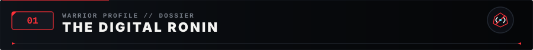

<br/><br/>



<br/><br/>



</div>

<br/><br/>

<div align="center">

<!-- ======================================================== -->
<!-- KATANA DIVIDER 02                                        -->
<!-- ======================================================== -->


<br/><br/>

<!-- ======================================================== -->
<!-- 02 // TECH ARSENAL                                       -->
<!-- ======================================================== -->

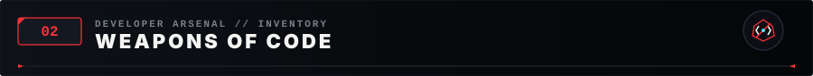

</div>

<p align="left"><em>A curated inventory of the languages, frameworks, and tools deployed across missions:</em></p>

### Languages

<p align="left">
  
</p>

### Frameworks & Libraries

<p align="left">
  
</p>

### Backend & APIs

<p align="left">
  
</p>

### Databases, Cloud & DevOps

<p align="left">
  
</p>

### Tools & Operations

<p align="left">
  
</p>

<div align="center">

<br/><br/>

<!-- ======================================================== -->
<!-- BLADE TRANSITION                                         -->
<!-- ======================================================== -->



<br/><br/>

<!-- ======================================================== -->
<!-- 03 // PROJECT DATABASE // RONIN ARCHIVES                 -->
<!-- ======================================================== -->

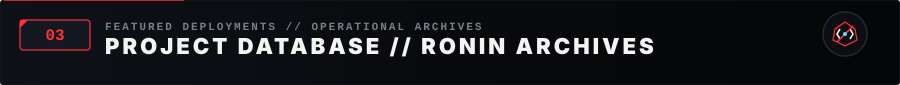

</div>

<br/>

<table width="100%">
  <tr>
    <td width="50%" valign="top">
      <h4>🛡️ <a href="https://github.com/codexanjan/upishield" target="_blank">UpiShield</a> // Real-Time Threat Shield</h4>
      <p>Next-gen UPI payment fraud defense system engineered with heuristic anomaly detection, risk scoring, and instant transaction shield telemetry.</p>
      <ul>
        <li><strong>Focus:</strong> Payment fraud detection, VPA threat scoring &amp; automated SMS defense</li>
        <li><strong>Stack:</strong> <code>TypeScript</code> <code>React 19</code> <code>Tailwind CSS</code> <code>FastAPI</code> <code>Cybersecurity AI</code></li>
        <li><strong>Repository:</strong> <a href="https://github.com/codexanjan/upishield" target="_blank"><code>codexanjan/upishield</code></a></li>
      </ul>
    </td>
    <td width="50%" valign="top">
      <h4>🔐 <a href="https://github.com/codexanjan/nexusvault" target="_blank">NexusVault</a> // Zero-Trust Cyber Vault</h4>
      <p>Enterprise zero-trust cybersecurity vault &amp; credential health platform with biometric entropy generation and live breach detection radar.</p>
      <ul>
        <li><strong>Focus:</strong> Zero-trust vault architecture, entropy generation &amp; security auditing</li>
        <li><strong>Stack:</strong> <code>TypeScript</code> <code>React 19</code> <code>Tailwind CSS</code> <code>Web Crypto API</code></li>
        <li><strong>Repository:</strong> <a href="https://github.com/codexanjan/nexusvault" target="_blank"><code>codexanjan/nexusvault</code></a></li>
      </ul>
    </td>
  </tr>
  <tr>
    <td width="50%" valign="top">
      <h4>⚡ <a href="https://github.com/codexanjan/nexa-ai-notice-analyzer" target="_blank">NEXA</a> // AI Notice Intelligence System</h4>
      <p>Autonomous circular intelligence platform parsing administrative circulars, extracting deadlines &amp; assigning priority rankings with Gemini AI.</p>
      <ul>
        <li><strong>Focus:</strong> Autonomous circular parsing, task extraction &amp; cognitive priority scoring</li>
        <li><strong>Stack:</strong> <code>Python</code> <code>Gemini AI</code> <code>FastAPI</code> <code>React</code> <code>NLP / OCR</code></li>
        <li><strong>Repository:</strong> <a href="https://github.com/codexanjan/nexa-ai-notice-analyzer" target="_blank"><code>codexanjan/nexa-ai-notice-analyzer</code></a></li>
      </ul>
    </td>
    <td width="50%" valign="top">
      <h4>🔗 <a href="https://github.com/codexanjan/urlforge" target="_blank">URLForge</a> // Link Forge &amp; Analytics</h4>
      <p>High-performance full-stack URL shortener SaaS featuring real-time clickstream telemetry, QR generation suite, and containerized FastAPI backend.</p>
      <ul>
        <li><strong>Focus:</strong> Sub-millisecond URL resolution, click analytics &amp; RESTful API design</li>
        <li><strong>Stack:</strong> <code>TypeScript</code> <code>React</code> <code>FastAPI</code> <code>Docker</code> <code>RESTful API</code></li>
        <li><strong>Repository:</strong> <a href="https://github.com/codexanjan/urlforge" target="_blank"><code>codexanjan/urlforge</code></a></li>
      </ul>
    </td>
  </tr>
  <tr>
    <td width="50%" valign="top">
      <h4>⚛️ <a href="https://github.com/codexanjan/periodictable" target="_blank">PeriodicPortal</a> // 3D Chemistry Hub</h4>
      <p>Educational 3D web platform exploring 118 chemical elements with neon glowing cards, 3D Bohr orbital simulations, and built-in AI Chemistry assistant.</p>
      <ul>
        <li><strong>Focus:</strong> 3D orbital visualization, chemical trend analytics &amp; AI dialogue</li>
        <li><strong>Stack:</strong> <code>TypeScript</code> <code>React</code> <code>Three.js</code> <code>WebGL</code> <code>Chemistry AI</code></li>
        <li><strong>Repository:</strong> <a href="https://github.com/codexanjan/periodictable" target="_blank"><code>codexanjan/periodictable</code></a></li>
      </ul>
    </td>
    <td width="50%" valign="top">
      <h4>⚡ <a href="https://github.com/codexanjan/Zenitsu" target="_blank">Zenitsu Agatsuma</a> // Cinematic Thunder Hub</h4>
      <p>Cinematic interactive anime portfolio with real-time Web Audio API frequency analysis, procedural lightning canvas, and 3D spatial soundscapes.</p>
      <ul>
        <li><strong>Focus:</strong> Procedural lightning canvas, Web Audio frequency analyzer &amp; combat VFX</li>
        <li><strong>Stack:</strong> <code>JavaScript</code> <code>HTML5 Canvas</code> <code>Web Audio API</code> <code>CSS Animations</code></li>
        <li><strong>Repository:</strong> <a href="https://github.com/codexanjan/Zenitsu" target="_blank"><code>codexanjan/Zenitsu</code></a></li>
      </ul>
    </td>
  </tr>
</table>

<br/><br/>

<div align="center">

<!-- ======================================================== -->
<!-- KATANA DIVIDER 03                                        -->
<!-- ======================================================== -->


<br/><br/>

<!-- ======================================================== -->
<!-- 04 // COMMIT RADAR // CODE CADENCE                       -->
<!-- ======================================================== -->

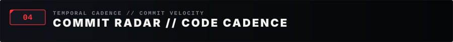

<br/><br/>

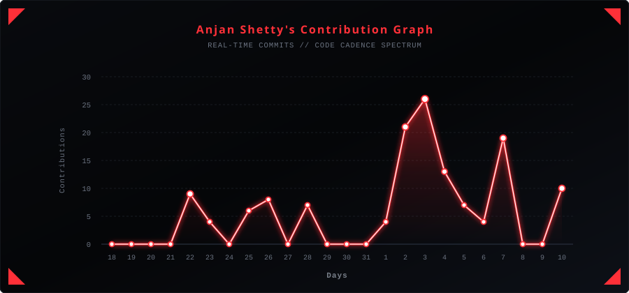

<br/><br/>

<!-- ======================================================== -->
<!-- KATANA DIVIDER 04                                        -->
<!-- ======================================================== -->


<br/><br/>

<!-- ======================================================== -->
<!-- 05 // CONTRIBUTION PATROL // RONIN CADENCE               -->
<!-- ======================================================== -->

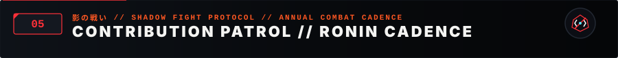

<br/><br/>



<br/><br/>



<br/><br/>

<!-- ======================================================== -->
<!-- KATANA DIVIDER 05                                        -->
<!-- ======================================================== -->


<br/><br/>

<!-- ======================================================== -->
<!-- 06 // 2026 MISSION DIRECTIVES // ROADMAP                 -->
<!-- ======================================================== -->

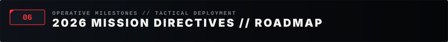

</div>

<br/>

<p><em>Operative milestones scheduled across the 2026 tactical deployment roadmap:</em></p>

- [x] 🚀 **Initialize Ronin Telemetry HUD**: Deploy interactive mainframe profile &amp; real-time analytics.
- [ ] 🧠 **2,000+ Algorithmic Directives**: Solve 2,000+ DSA problems across LeetCode, CodeWars, and GeeksforGeeks.
- [ ] 🏆 **5 Elite Hackathons**: Compete and architect high-impact solutions in national &amp; global hackathons.
- [ ] 🚀 **10 Production-Grade Systems**: Ship 10 resilient, scalable full-stack applications with CI/CD.
- [ ] 📈 **1,000 Sustained Contributions**: Maintain consistent open-source engineering cadence and commits.
- [ ] 🤖 **Deploy End-to-End AI SaaS**: Architect and launch a multi-tenant applied AI product solving real problems.

<br/>

<div align="center">

<br/>

<!-- ======================================================== -->
<!-- KATANA DIVIDER 06                                        -->
<!-- ======================================================== -->


<br/><br/>

<!-- ======================================================== -->
<!-- 07 // TROPHY ROOM // SAMURAI ACCOLADES                   -->
<!-- ======================================================== -->

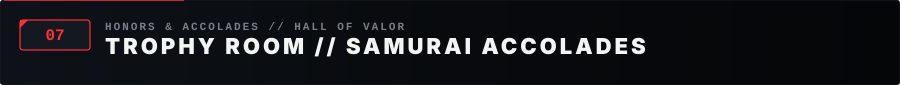

<br/><br/>

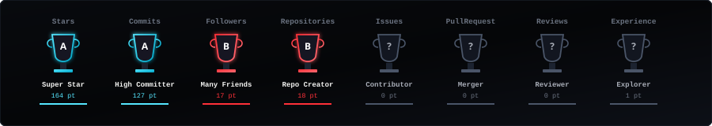

<br/><br/>

<!-- ======================================================== -->
<!-- KATANA DIVIDER 07                                        -->
<!-- ======================================================== -->


<br/><br/>

<!-- ======================================================== -->
<!-- 08 // RONIN TELEMETRY // MAINFRAME METRICS               -->
<!-- ======================================================== -->

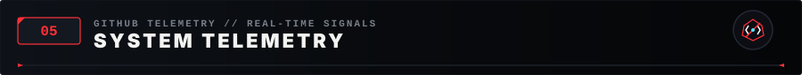

</div>

<br/>

<p align="left"><em>Telemetry and code activity monitored through GitHub's analytical services:</em></p>

<div align="center">

<br/>

<a href="https://github.com/codexanjan">
  
</a>

<br/><br/>



<br/><br/>

<p align="center">
  <a href="https://github.com/codexanjan" target="_blank">
    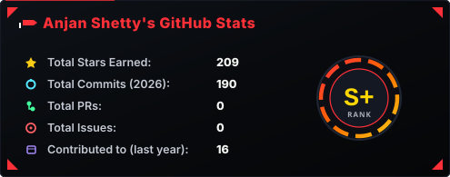
  </a>
  &nbsp;&nbsp;
  <a href="https://github.com/codexanjan" target="_blank">
    
  </a>
</p>

<br/><br/>

<!-- ======================================================== -->
<!-- KATANA DIVIDER 08                                        -->
<!-- ======================================================== -->


<br/><br/>

<!-- ======================================================== -->
<!-- 09 // RONIN COMMS // SECURE CHANNELS                     -->
<!-- ======================================================== -->

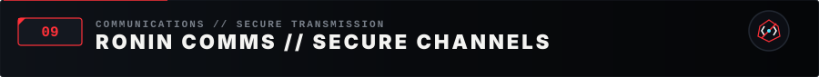

</div>

<br/>

<p align="left"><em>Connect across developer networks and platforms:</em></p>

<div align="center">

<br/>

<a href="https://github.com/codexanjan" target="_blank">
  
</a>
<a href="https://twitter.com/anjxnshetty" target="_blank">
  
</a>
<a href="https://discord.com/users/codexanjan" target="_blank">
  
</a>
<a href="https://gitlab.com/codexanjan" target="_blank">
  
</a>
<a href="https://leetcode.com/u/anjanshetty" target="_blank">
  
</a>
<a href="https://www.codewars.com/users/codexanjan" target="_blank">
  
</a>
<a href="https://www.geeksforgeeks.org/profile/anjanshetty" target="_blank">
  
</a>
<a href="https://tryhackme.com/p/anjanshetty" target="_blank">
  
</a>
<a href="https://dev.to/anjanshetty" target="_blank">
  
</a>
<a href="https://stackoverflow.com/users/anjanshetty" target="_blank">
  
</a>
<a href="https://reddit.com/u/anjxnshetty" target="_blank">
  
</a>

<br/><br/>

<p><em>If you find value in my open-source work or want to support my technical journey:</em></p>

<a href="https://buymeacoffee.com/anjxnshetty" target="_blank">
  
</a>

<br/><br/>

<!-- ======================================================== -->
<!-- RONIN TERMINAL // COMMAND SHELL                          -->
<!-- ======================================================== -->

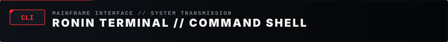

<br/><br/>



<br/><br/>

<!-- ======================================================== -->
<!-- FOOTER CREED TYPING TERMINAL                             -->
<!-- ======================================================== -->

<a href="https://github.com/codexanjan">
  
</a>

<br/><br/>

<!-- ======================================================== -->
<!-- MONOLITHIC RONIN FOOTER                                  -->
<!-- ======================================================== -->



<br/><br/>

```txt
[ TRANSMISSION END // CODEXANJAN // RONIN PROTOCOL 0x994 // ALL SYSTEMS ARMED ]
```

</div>
